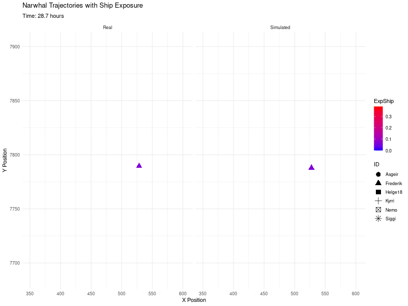

In this analysis, we fit SDE models to the narwhal data. In this preliminary work, the analysis is made without considering any constraints on the motion. Only the effect of the distance to the ship will be considered in the response model.

# Set up

```{r setup, include=FALSE}
knitr::opts_chunk$set(echo = TRUE)
```

```{r packages,message=FALSE}
set.seed(42)

library(smoothSDE) #sde fit
library(ggplot2)  #plots
library(dplyr)    #manipulate dataframes
library(tidyr)    # same
library(plotly)   # dynamic plots
library(htmlwidgets)  #save dynamic plots
library(mgcv)    # mixed models
library(here)    # path management
library(xtable)  # for latex tables
library(sf)      # read shapefile for land polygons
library(gganimate) # animated trajectories

```

```{r get data}

# Set the path to the directory containing the data
narwhal_data_path <- here("Data", "preprocessed_data","narwhals")  

#data before exposure with first 24h removed
dataBE24=read.csv(file.path(narwhal_data_path,"DataBE1.csv"), 
                  header = TRUE,dec = ".")

#data before exposure with first 12h removed
dataBE12=read.csv(file.path(narwhal_data_path,"DataBE2.csv"),
                  header = TRUE,dec = ".")

#data after exposure
dataAE=read.csv(file.path(narwhal_data_path,"DataAE.csv"),
                header = TRUE,dec = ".")


N=length(unique(dataBE12$ID))

n_pre12=length(dataBE12$time) #nb of obs before exposure with first 12h removed
n_pre24=length(dataBE24$time) #nb of obs before exposure with first 24h removed
n_post=length(dataAE$time) #number of observations after exposure

```

# Baseline CTCRW models

## CTCRW without random individual effects

We fit a baseline CTCRW with constant parameters (no covariates) on the data before exposure \texttt{dateBE12}. The mean velocity $\mu$ is fixed to $(0,0)$ because we are not investigating a long term migration movement.

```{r fit baseline ctcrw without random effects,message=FALSE}

#initial parameters
par0 <- c(0,0,1,4)

#model formula
formulas <- list(mu1=~1,mu2=~1,tau =~1,nu=~1)

#Fit baseline with measurement error estimated from the data
baseline_ctcrw0<- SDE$new(formulas = formulas,data = dataBE12,type = "CTCRW",
                          response = c("x","y"),
                          par0 = par0,
                          other_data=list("log_sigma_obs0"=log(0.05)),
                          fixpar=c("mu1","mu2"))
baseline_ctcrw0$fit()


```

We now extract the estimated parameters and their standard deviations. These estimates are on the log-scale.

```{r results baseline_ctcrw0}

estimates_bas_ctcrw0=as.list(baseline_ctcrw0$tmb_rep(),what="Est")
std_bas_ctcrw0=as.list(baseline_ctcrw0$tmb_rep(),what="Std")

```

We process the results and show a table with the estimates and their standard deviations.

```{r render coefficient estimates table baseline_ctcrw0 }

# Function to extract estimate values into a data frame format
combine_to_df <- function(estimates, std_dev, param_name) {
  data.frame(
    Parameter = param_name,
    Estimate = unlist(estimates, use.names = FALSE),
    Std_Error = unlist(std_dev, use.names = FALSE)
  )
}

# Create data frames for each set
log_sigma_obs <- combine_to_df(estimates_bas_ctcrw0$log_sigma_obs, 
                               std_bas_ctcrw0$log_sigma_obs, "log_sigma_obs")
coeff_fe <- combine_to_df(estimates_bas_ctcrw0$coeff_fe, 
                          std_bas_ctcrw0$coeff_fe, 
                          rownames(estimates_bas_ctcrw0$coeff_fe))

# Combine all data frames into one
table_data_baseline_ctcrw0 <- bind_rows(log_sigma_obs, coeff_fe)

```

```{r, results='asis',message=FALSE}
latex_table <- xtable(table_data_baseline_ctcrw0, 
                      caption = "Parameter Estimates and Standard Errors")

# Print LaTeX table
print(latex_table, type = "latex", include.rownames = FALSE,table.placement="H")
```

From this we can obtain $95\%$ confidence intervals for the parameters $\tau$, $\nu$ and $\sigma_{obs}$.

```{r CI baseline_ctcrw0 parameters}

post_coeff_bas_ctrcw0=baseline_ctcrw0$post_coeff(n_post=10000)
post_par_bas_ctcrw0=
  list("sigma_obs"=1000*exp(post_coeff_bas_ctrcw0$log_sigma_obs),
              "tau"=exp(post_coeff_bas_ctrcw0$coeff_fe[,"tau.(Intercept)"]),
              "nu"=exp(post_coeff_bas_ctrcw0$coeff_fe[,"nu.(Intercept)"]))
mean_par_bas_ctcrw0=lapply(post_par_bas_ctcrw0,mean)
sd_par_bas_ctcrw0=lapply(post_par_bas_ctcrw0,sd)
quant_par_bas_ctcrw0 <- lapply(post_par_bas_ctcrw0, 
                               quantile, probs = c(0.025, 0.975))

```

We include the results in a latex table.

```{r CI table baseline_ctcrw0 parameters,results='asis',message=FALSE}

parameter_names <- names(mean_par_bas_ctcrw0)
estimates <- mean_par_bas_ctcrw0
conf_intervals <- sapply(parameter_names, function(param) {
  sprintf("$[%.2f; %.2f]$", quant_par_bas_ctcrw0[[param]][1], 
          quant_par_bas_ctcrw0[[param]][2])
})

table_data <- data.frame(
  Parameter = c("$\\sigma_{obs}$","$\\tau$", "$\\nu$"),
  Estimate = sprintf("$%.2f$", mean_par_bas_ctcrw0),
  CI = conf_intervals,
  stringsAsFactors = FALSE
)


```

```{r,results='asis',echo=FALSE}
# Create an xtable object
xtab <- xtable(
  table_data,
  caption = "Baseline estimations",
  label = "table:baseline_estimations"
)

# Customize xtable options
print(
  xtab,
  include.rownames = FALSE,
  sanitize.text.function = identity,  # Prevent escaping of LaTeX math symbols
  hline.after = c(-1, 0, nrow(table_data)),
  table.placement="H"
)
```

The estimate for $\tau$ is $\bar \tau =1.08$ h and the estimate for $\nu$ is $\bar \nu =4.69$ km/h. The measurement error standard deviation is estimated to $\bar \sigma_{obs}\simeq 38$ m. The measurement error in Fastloc GPS data mainly depends on the number of satellite that were used to compute the location. This number might change from a data point to another. However, we don't know the number of satellites that computed the position in the data. That is why we assume a constant standard deviation for the measurement error. We know from Weensveen paper, table 3, that it should be at most around 30m when only 4 satellites are involved, and then decrease as the number of satellites increases. This suggest that the measurement error might be slightly overestimated here.

## Sensitivity to measurement error standard deviation

To investigate the sensitivity of the parameters estimates to the measurement error, we fix $\sigma_{obs}$ to different values and estimate the parameters again.

```{r fit baseline ctcrw fixed error without random effects,message=FALSE}

#fixed values for std of measurement error
sigma_obs=c(0.025,0.05,0.075,0.1)
list_baseline_ctcrw0=list()

for (i in 1:length(sigma_obs)){
  
  H=array(rep(sigma_obs[i]^2*diag(2),n_pre12),dim=c(2,2,n_pre12))

  baseline_ctcrw0_fixed_error<- SDE$new(formulas = formulas,data = dataBE12,
                                        type = "CTCRW",
                              response = c("x","y"),
                    par0 = par0,other_data=list("H"=H),fixpar=c("mu1","mu2"))
  baseline_ctcrw0_fixed_error$fit()
  list_baseline_ctcrw0[[i]]= baseline_ctcrw0_fixed_error
}


```

```{r results for baselines with fixed measurement error}
list_baseline_ctcrw0_est=list()
list_baseline_ctcrw0_std=list()

for (i in seq_along(list_baseline_ctcrw0)) {
  estimates=as.list(list_baseline_ctcrw0[[i]]$tmb_rep(),what="Est")
  std=as.list(list_baseline_ctcrw0[[i]]$tmb_rep(),what="Std")
  list_baseline_ctcrw0_est[[i]]=estimates
  list_baseline_ctcrw0_std[[i]]=std
}

```

```{r render estimates table baselines with fixed mesaurement error,results='asis', message=FALSE}

for (i in seq_along(list_baseline_ctcrw0)) {
  estimates=list_baseline_ctcrw0_est[[i]]
  std=list_baseline_ctcrw0_std[[i]]
  
  # Create data frames for each set
  log_sigma_obs <- combine_to_df(estimates$log_sigma_obs, 
                               std$log_sigma_obs, "log_sigma_obs")
  coeff_fe <- combine_to_df(estimates$coeff_fe, 
                          std$coeff_fe, 
                          rownames(estimates$coeff_fe))

  # Combine all data frames into one
  table_data <- bind_rows(log_sigma_obs, coeff_fe)
  
  latex_table <- xtable(
    table_data, 
    caption = paste(
      "Parameter Estimates and Standard Errors for fixed \\(\\sigma_{obs}=\\) ",
      sigma_obs[i]," m"),
    xtable.table.placement="H")

  # Print LaTeX table
  print(latex_table, type = "latex", include.rownames = FALSE,table.placement="H")

}

```

```{r plot tau and nu estimates as a function of measurement error}
tau_estimates=sapply(list_baseline_ctcrw0_est,
                     function(estimates) 
                       {exp(estimates$coeff_fe["tau.(Intercept)",1])})
nu_estimates=sapply(list_baseline_ctcrw0_est,
                    function(estimates) 
                      {exp(estimates$coeff_fe["nu.(Intercept)",1])})
tau_std=sapply(list_baseline_ctcrw0_std,
               function(std) {exp(std$coeff_fe["tau.(Intercept)",1])})
nu_std=sapply(list_baseline_ctcrw0_std,
              function(std) {exp(std$coeff_fe["nu.(Intercept)",1])})
df=as.data.frame(cbind(tau_estimates,nu_estimates,sigma_obs))
colnames(df)=c("tau","nu","sigma_obs")
df <- df %>%
  pivot_longer(cols = c(tau, nu), names_to = "parameter", values_to = "value")

ggplot(df, aes(x = 1000*sigma_obs, y = value)) +
  geom_point() +
  geom_line() +
  theme_minimal() +
  xlab("Sigma_obs") +
  ylab("Value") +
  ggtitle("Estimated Tau and Nu as functions of fixed Sigma_obs") +
  facet_wrap(~parameter, scales = "free_y")  # Facet by 'parameter' (tau or nu)

```

We see a clear effect of the fixed measurement error on the estimates of $\tau$, and a slight influence of $\nu$. We also remark that as the measurement error grows, the uncertainty on the estimates of $\tau$ and $\nu$ increases. Overall, knowing or estimating precisely the measurement error will be crucial in the analysis.

### CTCRW with random individual effects

```{r fit baseline ctcrw with random effects,cache=TRUE,message=FALSE}


#model formula
formulas <- list(mu1=~1,mu2=~1,tau =~s(ID,bs="re"),nu=~s(ID,bs="re"))

#Fit baseline with measurement error estimated from the data
baseline_ctcrw1<- SDE$new(formulas = formulas,data = dataBE12,type = "CTCRW",
                          response = c("x","y"),
                    par0 = par0,other_data=list("log_sigma_obs0"=log(0.05)),
                    fixpar=c("mu1","mu2"))
baseline_ctcrw1$fit()


```

```{r results baseline_ctcrw1}

estimates_bas_ctcrw1=as.list(baseline_ctcrw1$tmb_rep(),what="Est")
std_bas_ctcrw1=as.list(baseline_ctcrw1$tmb_rep(),what="Std")

```

```{r render estimates table baseline_ctcrw1}

# Create data frames for each set
log_sigma_obs <- combine_to_df(estimates_bas_ctcrw1$log_sigma_obs,
                               std_bas_ctcrw1$log_sigma_obs, "log_sigma_obs")
coeff_fe <- combine_to_df(estimates_bas_ctcrw1$coeff_fe,
                          std_bas_ctcrw1$coeff_fe,
                          rownames(estimates_bas_ctcrw1$coeff_fe))
log_lambda <- combine_to_df(estimates_bas_ctcrw1$log_lambda, 
                            std_bas_ctcrw1$log_lambda, 
                            rownames(estimates_bas_ctcrw1$log_lambda))
coeff_re <- combine_to_df(estimates_bas_ctcrw1$coeff_re, 
                          std_bas_ctcrw1$coeff_re, 
                          rownames(estimates_bas_ctcrw1$coeff_re))

# Combine all data frames into one
table_data_baseline_ctcrw1 <- bind_rows(log_sigma_obs, coeff_fe, log_lambda, coeff_re)

```

```{r, results='asis', echo=FALSE}
latex_table <- xtable(table_data_baseline_ctcrw1, 
                      caption = "Parameter Estimates and Standard Errors")

# Print LaTeX table
print(latex_table, type = "latex", include.rownames = FALSE,table.placement="H")
```

As previously, we can obtain $95\%$ confidence intervals for the parameters $\tau$, $\nu$ and $\sigma_{obs}$, and include the results in a latex table.

```{r CI baseline_ctcrw1 parameters}

post_coeff_bas_ctrcw1=baseline_ctcrw1$post_coeff(n_post=10000)
post_par_bas_ctcrw1=list(
  "sigma_obs"=1000*exp(post_coeff_bas_ctrcw1$log_sigma_obs),
  "tau"=exp(post_coeff_bas_ctrcw1$coeff_fe[,"tau.(Intercept)"]),
  "nu"=exp(post_coeff_bas_ctrcw1$coeff_fe[,"nu.(Intercept)"]),
  "sigma_tau"=1/sqrt(exp(post_coeff_bas_ctrcw1$log_lambda[,"tau.s(ID)"])),
  "sigma_nu"=1/sqrt(exp(post_coeff_bas_ctrcw1$log_lambda[,"nu.s(ID)"])))

mean_par_bas_ctcrw1=lapply(post_par_bas_ctcrw1,mean)
sd_par_bas_ctcrw1=lapply(post_par_bas_ctcrw1,sd)
quant_par_bas_ctcrw1 <- lapply(post_par_bas_ctcrw1, 
                               quantile, probs = c(0.025, 0.975))

```

```{r CI table baseline_ctcrw1 parameters, message=FALSE}

parameter_names <- names(mean_par_bas_ctcrw1)
estimates <- mean_par_bas_ctcrw1
conf_intervals <- sapply(parameter_names, function(param) {
  sprintf("$[%.2f; %.2f]$", quant_par_bas_ctcrw1[[param]][1], 
          quant_par_bas_ctcrw1[[param]][2])
})

table_data <- data.frame(
  Parameter = 
    c("$\\sigma_{obs}$","$\\tau$", "$\\nu$","$\\sigma_{\\tau}$","$\\sigma_{\\nu}$"),
  Estimate = sprintf("$%.2f$", mean_par_bas_ctcrw1),
  CI = conf_intervals,
  stringsAsFactors = FALSE
)


```
```{r,results='asis',echo=FALSE}
xtab <- xtable(
  table_data,
  caption = "Baseline estimations with random effects",
  label = "table:baseline_estimations_with_random_effects"
)

print(
  xtab,type="latex",
  include.rownames = FALSE,
  sanitize.text.function = identity,  # Prevent escaping of LaTeX math symbols
  hline.after = c(-1, 0, nrow(table_data)),  
  table.placement="H"
)
```

Note that the random effect is multiplicative and not additive since it appears in the $\log$ of the parameters. We can plot the estimates on the parameter scale for each narwhal.

```{r plot baseline_ctcrw1 estimates,results='hide'}

baseline_ctcrw1$get_all_plots(baseline=NULL,show_CI="simultaneous")

```

### RACVM without random individual effects

We can also test whether adding a constant rotational $\omega$ in the SDE model would make sense. For this, we fit a RACVM model.

```{r fit baseline racvm,message=FALSE}

#initial parameters
par0 <- c(0,0,1,4,0)

#model formula
formulas <- list(mu1=~1,mu2=~1,
                 tau =~1,
                 nu=~1,
                 omega=~1)


#Fit baseline with measurement error estimated from the data
baseline_racvm0<- SDE$new(formulas = formulas,data = dataBE12,type = "RACVM",
                          response = c("x","y"),
                    par0 = par0,other_data=list("log_sigma_obs0"=log(0.05)),
                    fixpar=c("mu1","mu2"))
baseline_racvm0$fit()


```

```{r results baseline_racvm0}

estimates_bas_racvm0=as.list(baseline_racvm0$tmb_rep(),what="Est")
std_bas_racvm0=as.list(baseline_racvm0$tmb_rep(),what="Std")


```

```{r render estimates table baseline_racvm0}

# Create data frames for each set
log_sigma_obs <- combine_to_df(estimates_bas_racvm0$log_sigma_obs, 
                               std_bas_racvm0$log_sigma_obs, "log_sigma_obs")
coeff_fe <- combine_to_df(estimates_bas_racvm0$coeff_fe,
                          std_bas_racvm0$coeff_fe, 
                          rownames(estimates_bas_racvm0$coeff_fe))

# Combine all data frames into one
table_data_baseline_racvm0 <- bind_rows(log_sigma_obs, coeff_fe)

```

```{r, results='asis', echo=FALSE}
latex_table <- xtable(table_data_baseline_racvm0, 
                      caption = "Parameter Estimates and Standard Errors")

# Print LaTeX table
print(latex_table, type = "latex", include.rownames = FALSE,table.placement="H")
```

The estimate of $\omega$ is $0$. This indicates that a \textbf{constant} parameter $\omega$ is irrelevant in the model. As a consequence, the final baseline model we keep is \texttt{baseline\_ctcrw1} which corresponds to a CTCRW with constant parameters $\tau$ and $\nu$ and mean velocity fixed to zero.

## Sensitivity analysis of the baseline CTCRW to the tagging effect threshold

In this first analysis, we only removed 12h of data after the tagging for each narwhal. However, the narwhals might still be affected by the tagging and not behave "normally". This would invalidate all our conclusions in the response model, if the baseline model happens to be biased. Therefore, we need to assess the sensitivity of the baseline model to the time threshold we choose for the tagging effect. Here, we only repeat the fit for the model \texttt{baseline\_ctcrw1} with the sub dataset \texttt{dataBE24} where all the data until 24h after tagging have been removed.

```{r fit baseline sensitivity analysis tagging effect,message=FALSE}

#initial parameters
par0 <- c(0,0,1,4)

#model formula
formulas <- list(mu1=~1,mu2=~1,tau =~s(ID,bs="re"),nu=~s(ID,bs="re"))

#Fit baseline with measurement error estimated from the data
baseline_ctcrw1_24h<- SDE$new(
  formulas = formulas,data = dataBE24,type = "CTCRW",
  response = c("x","y"),par0 = par0,
  other_data=list("log_sigma_obs0"=log(0.05)),
  fixpar=c("mu1","mu2"))

baseline_ctcrw1_24h$fit()


```

```{r results baseline_ctcrw1_24h}

estimates_bas_ctcrw1_24h=as.list(baseline_ctcrw1_24h$tmb_rep(),what="Est")
std_bas_ctcrw1_24h=as.list(baseline_ctcrw1_24h$tmb_rep(),what="Std")

```

```{r render estimates table baseline_ctcrw1_24h}


# Create data frames for each set
log_sigma_obs <- combine_to_df(
  estimates_bas_ctcrw1_24h$log_sigma_obs, 
  std_bas_ctcrw1_24h$log_sigma_obs, "log_sigma_obs")

coeff_fe <- combine_to_df(estimates_bas_ctcrw1_24h$coeff_fe, 
                          std_bas_ctcrw1_24h$coeff_fe, 
                          rownames(estimates_bas_ctcrw1_24h$coeff_fe))

# Combine all data frames into one
table_data_baseline_ctcrw1_24h <- bind_rows(log_sigma_obs, coeff_fe)

```

```{r, results='asis',echo=FALSE}
latex_table <- xtable(table_data_baseline_ctcrw1_24h, 
                      caption = "Parameter Estimates and Standard Errors")

# Print LaTeX table
print(latex_table, type = "latex", include.rownames = FALSE,
      table.placement="H")
```

The standard deviations are wider due to the smaller amount of data, but also due to the fact that the measurement error is estimated higher than before. $\tau$ seems to be estimated slightly below the value we obtained for the dataset \texttt{dataBE12}, but the difference seems reasonable as the CI of the two estimates overlap.

```{r fit baseline sensitivity analysis tagging effect fixed error,message=FALSE}

sigma_obs=exp(estimates_bas_ctcrw1$log_sigma_obs)
H=array(rep(sigma_obs^2*diag(2),n_post),dim=c(2,2,n_post))

#Fit baseline with measurement error 
baseline_ctcrw1_24h_fixed_error<- SDE$new(formulas = formulas,
                                          data = dataBE24,type = "CTCRW",
                                          response = c("x","y"),
                                          par0 = par0,
                                          other_data=list("H"=H),
                                          fixpar=c("mu1","mu2"))
baseline_ctcrw1_24h_fixed_error$fit()


```

```{r results baseline_ctcrw1_24h_fixed_error}

estimates_bas_ctcrw1_24h_fixed_error=as.list(
  baseline_ctcrw1_24h_fixed_error$tmb_rep(),what="Est")
std_bas_ctcrw1_24h_fixed_error=as.list(
  baseline_ctcrw1_24h_fixed_error$tmb_rep(),what="Std")

```

```{r render estimates table baseline_ctcrw1_24h_fixed_error }


# Create data frames for each set
log_sigma_obs <- combine_to_df(
  estimates_bas_ctcrw1_24h_fixed_error$log_sigma_obs,
  std_bas_ctcrw1_24h_fixed_error$log_sigma_obs, "log_sigma_obs")
coeff_fe <- combine_to_df(
  estimates_bas_ctcrw1_24h_fixed_error$coeff_fe, 
  std_bas_ctcrw1_24h_fixed_error$coeff_fe, 
  rownames(estimates_bas_ctcrw1_24h_fixed_error$coeff_fe))

# Combine all data frames into one
table_data_baseline_ctcrw1_24h_fixed_error <- bind_rows(log_sigma_obs, coeff_fe)

```

```{r, results='asis',echo=FALSE}
latex_table <- xtable(table_data_baseline_ctcrw1_24h_fixed_error, 
                      caption = "Parameter Estimates and Standard Errors")

# Print LaTeX table
print(latex_table, type = "latex", include.rownames = FALSE,
      table.placement="H")
```

When the measurement error is fixed to the value we initially estimated from the whole dataset \texttt{dateBE12}, we observe a big decrease in the estimate of $\tau$. This indeed suggest a shift in the behavior of the whales within the time interval [12h,24h] after tagging, which might invalidate our results.

# Response CTCRW models

## Response CTCRW with constant parameters

First, we try to fit the exact same model as \texttt{baseline\_ctcrw1} on the data during exposure to assess a potential shift in the behavior due to the presence of the ship. We fix the measurement error to the value that has been estimated from the data before exposure.

```{r fit response constant parameters,message=FALSE}

#initial parameters
par0 <- c(0,0,1,4)

#model formula
formulas <- list(mu1=~1,mu2=~1,tau =~s(ID,bs="re"),nu=~s(ID,bs="re"))

sigma_obs=exp(estimates_bas_ctcrw1$log_sigma_obs)
H=array(rep(sigma_obs^2*diag(2),n_post),dim=c(2,2,n_post))

#Fit respopnse with measurement error estimated from the baseline
response_ctcrw1<- SDE$new(formulas = formulas,data = dataAE,type = "CTCRW",
                          response = c("x","y"),
                          par0 = par0,
                          other_data=list("H"=H),
                          fixpar=c("mu1","mu2"))
response_ctcrw1$fit()

```

```{r results response_ctcrw1}

estimates_res_ctcrw1=as.list(response_ctcrw1$tmb_rep(),what="Est")
std_res_ctcrw1=as.list(response_ctcrw1$tmb_rep(),what="Std")


```

```{r render estimates table response_ctcrw1}

# Create data frames for each set
log_sigma_obs <- combine_to_df(estimates_res_ctcrw1$log_sigma_obs, 
                               std_res_ctcrw1$log_sigma_obs, "log_sigma_obs")
coeff_fe <- combine_to_df(estimates_res_ctcrw1$coeff_fe,
                          std_res_ctcrw1$coeff_fe, 
                          rownames(estimates_res_ctcrw1$coeff_fe))

# Combine all data frames into one
table_data_response_ctcrw1 <- bind_rows(log_sigma_obs, coeff_fe)

```

```{r, results='asis', echo=FALSE}
latex_table <- xtable(table_data_response_ctcrw1, 
                      caption = "Parameter Estimates and Standard Errors")

# Print LaTeX table
print(latex_table, type = "latex", include.rownames = FALSE,
      table.placement="H")
```

The estimated standard deviation of the random effects can be computed with \texttt{sdev} method in \texttt{smoothSDE}.

```{r}
response_ctcrw1$sdev()
```

The estimates are lower than those obtained from the data before exposure. This may happen because we have short trajectories before exposure, that may not represent the whole range of possible movement for each narwhal, and therefore there may be more varieties of movements between the different individuals. On the contrary, the trajectories during exposure are longer so we can reasonably say that they represent better the range of possible movement. The lower standard deviation of the random effects might then indicate that on the long run, the narwhals in the study tend to have similar movement characteristics.

The estimated value for $\tau$ is slightly lower than the value we obtained from the data before exposure. The value for $\nu$ is also slightly lower. In both cases, the CI of the estimate overlaps with the CI of the estimate from the data before exposure. To better understand if this difference in the estimated values of the parameters is due to the presence of the ship, we will introduce the exposure to ship \texttt{ExpShip} (or $E_{ship}$ in the paper) covariate in the model.

## Response models with splines of ExpShip

The intercept of the parameters $\tau$ and $\nu$ are considered as offset in the statistical model, and fixed using the estimates we get from the baseline model \texttt{baseline\_ctcrw1}. The measurement error is an offset 7that is fixed to the value that has been estimated from the data before exposure.

In the response model, we suppose that the presence of the ship has a similar effect on all the narwhals. Therefore, we estimate a mean reaction (if any) to the presence of the ship. We are aware that a variety of reactions might be possible, depending on the narwhals habituation to noise or on the specific place where it has been approached by the ship for instance. This variety of reaction can be assessed visually by looking at a small subset of the data, but is difficult to infer statistically (see [Heide-Jorgensen2021] figure 7).

```{r response with splines,cache=TRUE}


#model formula
formulas <- list(mu1=~1,mu2=~1,
                 tau =~s(ExpShip,k=10,bs="cs")+s(ID,bs="re"),
                 nu=~s(ExpShip,k=10,bs="cs")+s(ID,bs="re"))


# Fit response with measurement error fixed to baseline value
sigma_obs=exp(estimates_bas_ctcrw1$log_sigma_obs)
H=array(rep(sigma_obs^2*diag(2),n_post),dim=c(2,2,n_post))
response_ctcrw_sp<- SDE$new(formulas = formulas,data = dataAE,type = "CTCRW",
                            response = c("x","y"),
                    par0 = par0,other_data=list("H"=H),fixpar=c("mu1","mu2"))

# fix random effects to baseline values
response_ctcrw_sp$update_coeff_re(
  c(rep(0,9),baseline_ctcrw1$coeff_re()[1:6,1],rep(0,9)
    ,baseline_ctcrw1$coeff_re()[7:12,1]))
response_ctcrw_sp$update_lambda(
  c(1,baseline_ctcrw1$lambda()[1,1],1,baseline_ctcrw1$lambda()[2,1]))
response_ctcrw_sp$update_coeff_fe(baseline_ctcrw1$coeff_fe())
#use the indices of the variable in the map for TMB 
#to keep the coefficients in the right order
#otherwise we may have issues in function post_coeff
response_ctcrw_sp$update_map(list(coeff_re=factor(
  c(1:9,rep(NA,6),10:18,rep(NA,6))),
  coeff_fe=factor(rep(NA,4)),
  log_lambda=factor(c(1,NA,2,NA))))


response_ctcrw_sp$fit()

```

```{r results response spline}

estimates_res_ctcrw_sp=as.list(response_ctcrw_sp$tmb_rep(),what="Est")
std_res_ctcrw_sp=as.list(response_ctcrw_sp$tmb_rep(),what="Std")


```

```{r render estimates table response_ctcrw_sp}


# Create data frames for each set
log_sigma_obs <- combine_to_df(estimates_res_ctcrw_sp$log_sigma_obs, 
                               std_res_ctcrw_sp$log_sigma_obs, "log_sigma_obs")
coeff_fe <- combine_to_df(estimates_res_ctcrw_sp$coeff_fe,
                          std_res_ctcrw_sp$coeff_fe,
                          rownames(estimates_res_ctcrw_sp$coeff_fe))
coeff_re <- combine_to_df(estimates_res_ctcrw_sp$coeff_re, 
                          std_res_ctcrw_sp$coeff_re, 
                          rownames(estimates_res_ctcrw_sp$coeff_re))
log_lambda <- combine_to_df(estimates_res_ctcrw_sp$log_lambda, 
                            std_res_ctcrw_sp$log_lambda, 
                            rownames(estimates_res_ctcrw_sp$log_lambda))

# Combine all data frames into one
table_data_response_ctcrw_sp <- bind_rows(
  log_sigma_obs, coeff_fe,coeff_re,log_lambda)

```

```{r,results='asis',echo=FALSE}
latex_table <- xtable(table_data_response_ctcrw_sp, 
                      caption = "Parameter Estimates and Standard Errors")

# Print LaTeX table
print(latex_table, type = "latex", include.rownames = FALSE,
      table.placement="H")
```

```{r plot smooth parameters response_ctcrw_sp}
plot_smooth_par=response_ctcrw_sp$plot_par(var="ExpShip",
                                           par_names=c("tau","nu"),
                                           n_post=100)

#get data for the plot
plot_data <- ggplot_build(plot_smooth_par)$data[[1]]
#rename columns
colnames(plot_data)[1:5]=c("mle","val","var","group","par")

# ELow exposure threshold
threshold <- 1 / 45 # 1/ max(distance to ship)
plot_data <- plot_data %>% filter(var > threshold)
plot_data$distance <- rep(1/plot_data[plot_data$group==1,"var"],
                          length(unique(plot_data$group)))

plot_data <- plot_data %>%
  mutate(mle= recode(mle, "#B300001A" = "no", "#000000FF" = "yes"))
plot_data <- plot_data %>%
  mutate(par= recode(par, "1" = "tau", "2" = "nu"))

pal <- c("no" = rgb(0.7, 0, 0, 0.1), "yes" = rgb(0, 0, 0, 1))
 
plot_smooth_par_distance=ggplot(plot_data, aes(x = distance, group = group)) +
  scale_colour_manual(values = pal, guide = "none") +
  facet_wrap(c("par"), scales = "free_y",strip.position = "left") +
  theme_minimal() + xlab("Distance to ship")  + 
  ggtitle("Smooth parameters as a function of distance to ship") +
  theme(strip.background = element_blank(),strip.placement = "outside",
        strip.text = element_text(colour = "black"))+
  geom_line(aes(y = val,color=mle))

plot_smooth_par_distance

```

The estimated smooth functions depend on the number of knots we choose in the splines. For $\nu$, the estimated smooth does not change as we increase gradually the degree of freedom to $10$, meaning that only a few knots (1 or 2) are needed. The effect of the presence of the ship on the parameter $\nu$ is easily interpreted : the closer the narwhals are to the ship, the higher their velocity, likely to move away or avoid the ship. Now, the estimated smooth function for $\tau$ requires more knots and is harder to interpret. Though there seem to be a decrease in persistence close to the ship, at a medium distance around $20$ km the persistence of the movement seem to increase. This is likely connected to figure 7 in [Heide-Jorgensen], where depending on how the narwhals were first exposed to the ship, they either change direction (lower persistence) or persist in their heading to flee away (higher persistence).

However, we only plot 100 posterior draws here. If we increase to $n_{post}=1000$ posterior draws, the confidence intervals appear much wider. We now construct confidence intervals from 1000 posterior draws of the estimated coeffs and compare the smooth parameter with the baseline parameter.

```{r plot CI response_ctcrw_sp and baseline_ctcrw0,results='hide'}

#plot parameters
xmin=list("ExpShip"=1/45)
xmax=list("ExpShip"=1/5)
link=list("ExpShip"=(\(x) 1/x))
xlabel=list("ExpShip"="Distance to ship")

response_ctcrw_sp$get_all_plots(baseline=baseline_ctcrw1,xmin=xmin,xmax=xmax,
                                link=link,xlabel=xlabel,show_CI="poinwise")

```

Even if there seems to be an influence of ExpShip over the parameters, the confidence intervals are too wide to really conclude.

## Log linear CTCRW response model with exponential of ExpShip

To simplify the analysis, instead of using spline, we now try a simpler log-linear model for the parameters $\tau$ and $\nu$, meaning that $\tau$ and $\nu$ are exponentials of a linear function of $E_{ship}$.

```{r fit response log linear}


#define model
formulas <- list(mu1=~1,mu2=~1,tau =~ExpShip+s(ID,bs="re"),
                 nu=~ExpShip+s(ID,bs="re"))


# Fit response with measurement error fixed to baseline value
sigma_obs=exp(estimates_bas_ctcrw1$log_sigma_obs)
H=array(rep(sigma_obs^2*diag(2),n_post),dim=c(2,2,n_post))

response_ctcrw_exp<- SDE$new(formulas = formulas,data = dataAE,type = "CTCRW",
                             response = c("x","y"),par0 = par0,
                             other_data=list("H"=H),fixpar=c("mu1","mu2"))


# fix random effects to baseline values
response_ctcrw_exp$update_coeff_re(baseline_ctcrw1$coeff_re())
response_ctcrw_exp$update_lambda(c(baseline_ctcrw1$lambda()))
response_ctcrw_exp$update_coeff_fe(
  c(baseline_ctcrw1$coeff_fe()[1:3,1],0,baseline_ctcrw1$coeff_fe()[4,1],0))
#use the indices of the variable in the map for TMB 
#to keep the coefficients in the right order
#otherwise we may have issues in function post_coeff
response_ctcrw_exp$update_map(list(coeff_re=factor(rep(NA,12)),
                             coeff_fe=factor(c(rep(NA,3),1,NA,2)),
                             log_lambda=factor(c(NA,NA))))


response_ctcrw_exp$fit()

```

```{r results response_ctcrw_exp}

estimates_res_ctcrw_exp=as.list(response_ctcrw_exp$tmb_rep(),what="Est")
std_res_ctcrw_exp=as.list(response_ctcrw_exp$tmb_rep(),what="Std")


```

```{r render estimates table response_ctcrw_exp}

# Create data frames for each set
log_sigma_obs <- combine_to_df(estimates_res_ctcrw_exp$log_sigma_obs, 
                               std_res_ctcrw_exp$log_sigma_obs, 
                               "log_sigma_obs")
coeff_fe <- combine_to_df(estimates_res_ctcrw_exp$coeff_fe, 
                          std_res_ctcrw_exp$coeff_fe,
                          rownames(estimates_res_ctcrw_exp$coeff_fe))

# Combine all data frames into one
table_data_response_ctcrw_exp <- bind_rows(log_sigma_obs, coeff_fe)

```

```{r, results='asis', echo=FALSE}
latex_table <- xtable(table_data_response_ctcrw_exp,
                      caption = "Parameter Estimates and Standard Errors")

# Print LaTeX table
print(latex_table, type = "latex", include.rownames = FALSE,
      table.placement="H")
```


We can also compute $95 \%$ CI for the coefficients in the log-linear model.

```{r CI response_ctcrw_exp parameters}

post_coeff_res_exp=response_ctcrw_exp$post_coeff(n_post=10000)
post_par_res_exp=list(
  "alpha_tau"=post_coeff_res_exp$coeff_fe[,"tau.ExpShip"],
  "alpha_nu"=post_coeff_res_exp$coeff_fe[,"nu.ExpShip"])

mean_par_res_exp=lapply(post_par_res_exp,mean)
sd_par_res_exp=lapply(post_par_res_exp,sd)
quant_par_res_exp <- lapply(post_par_res_exp, 
                               quantile, probs = c(0.025, 0.975))

```

```{r CI table response_ctcrw_exp parameters, message=FALSE}

parameter_names <- names(mean_par_res_exp)
estimates <- mean_par_res_exp
conf_intervals <- sapply(parameter_names, function(param) {
  sprintf("$[%.2f; %.2f]$", quant_par_res_exp[[param]][1], 
          quant_par_res_exp[[param]][2])
})

table_data <- data.frame(
  Parameter = 
    c("$\\alpha_{\\tau}$","$\\alpha_{\\nu}$"),
  Estimate = sprintf("$%.2f$", mean_par_res_exp),
  CI = conf_intervals,
  stringsAsFactors = FALSE
)

```


```{r,results='asis',echo=FALSE}
xtab <- xtable(
  table_data,
  caption = "Response log linear estimations",
  label = "table:response_log_linear_estimations"
)

print(
  xtab,type="latex",
  include.rownames = FALSE,
  sanitize.text.function = identity,  # Prevent escaping of LaTeX math symbols
  hline.after = c(-1, 0, nrow(table_data)),
  table.placement="H"
)
```


We can now plot the estimated smooth parameters.

```{r plot smooth parameters response_ctcrw_exp}

plot_smooth_par=response_ctcrw_exp$plot_par(var="ExpShip",
                                            par_names=c("tau","nu"),n_post=100)

#get data for the plot
plot_data <- ggplot_build(plot_smooth_par)$data[[1]]
#rename columns
colnames(plot_data)[1:5]=c("mle","val","var","group","par")

# ELow exposure threshold
threshold <- 1 / 45 # 1/ max(distance to ship)
plot_data <- plot_data %>% filter(var > threshold)
plot_data$distance <- rep(1/plot_data[plot_data$group==1,"var"],
                          length(unique(plot_data$group)))

plot_data <- plot_data %>%
  mutate(mle= recode(mle, "#B300001A" = "no", "#000000FF" = "yes"))
plot_data <- plot_data %>%
  mutate(par= recode(par, "1" = "tau", "2" = "nu"))

pal <- c("no" = rgb(0.7, 0, 0, 0.1), "yes" = rgb(0, 0, 0, 1))
 
plot_smooth_par_distance=ggplot(plot_data, aes(x = distance, group = group)) +
  scale_colour_manual(values = pal, guide = "none") +
  facet_wrap(c("par"), scales = "free_y",strip.position = "left") +
                theme_minimal() + xlab("Distance to ship") + ylab(NULL) + 
  ggtitle("Smooth parameters as a function of distance to ship") +
  theme(strip.background = element_blank(),strip.placement = "outside",
        strip.text = element_text(colour = "black"))+
  geom_line(aes(y = val,color=mle))

plot_smooth_par_distance
```

The results are indeed similar to what we obtain using cubic splines with a low degree of freedom.

```{r plot CI response_ctcrw_exp and baseline,results='hide'}

#plot parameters
xmin=list("ExpShip"=1/50)
xmax=list("ExpShip"=1/3)
link=list("ExpShip"=(\(x) 1/x))
xlabel=list("ExpShip"="Distance to ship")

response_ctcrw_exp$get_all_plots(baseline=baseline_ctcrw1,xmin=xmin,xmax=xmax,
                                 link=link,xlabel=xlabel,show_CI="pointwise")

```

## Baseline uncertainty propagation

In the foregoing, offset of the parameters are fixed to the baseline estimate. We did not propagate the uncertainty from the baseline estimate to the response model. To do this, we can draw values from the estimated distribution of the baseline parameters, and estimate the response for each drawn value.

```{r propagate baseline uncertainty, message=FALSE,results='hide',cache=TRUE}

#posterior samples of the baseline model coefficients
post_coeff=baseline_ctcrw1$post_coeff(n_post=200)

post_coeff_re=post_coeff$coeff_re
post_coeff_fe=post_coeff$coeff_fe
post_coeff_lambda=exp(post_coeff$log_lambda)
post_coeff_sigma_obs=exp(post_coeff$log_sigma_obs)


# Fit response for each draw of baseline coefficients

formulas <- list(mu1=~1,mu2=~1,tau =~ExpShip,nu=~ExpShip)


alpha_estimates=matrix(rep(0,2*nrow(post_coeff_fe)),ncol=2)
alpha_std=matrix(rep(0,2*nrow(post_coeff_fe)),ncol=2)

models_list=list()

for (i in 1:nrow(post_coeff_fe)) {
    
    formulas <- list(mu1=~1,mu2=~1,tau =~ExpShip+s(ID,bs="re"),
                 nu=~ExpShip+s(ID,bs="re"))
    
    sigma_obs=post_coeff_sigma_obs[i,1]
    H=array(rep(sigma_obs^2*diag(2),n_post),dim=c(2,2,n_post))
    
    response_ctcrw_exp_i<- SDE$new(formulas = formulas,data = dataAE,
                                   type = "CTCRW",
                                   response = c("x","y"),
                                   par0 = par0,
                                   other_data=list("H"=H),fixpar=c("mu1","mu2"))

    response_ctcrw_exp_i$update_map(list(coeff_re=factor(rep(NA,12)),
                             coeff_fe=factor(c(rep(NA,3),1,NA,2)),
                             log_lambda=factor(c(NA,NA))))
    
    new_coeff_fe=c(post_coeff_fe[i,1:3],0,post_coeff_fe[i,4],0)
    response_ctcrw_exp_i$update_coeff_fe(new_coeff_fe)
    
    response_ctcrw_exp_i$update_lambda(post_coeff_lambda[i,])
    
    response_ctcrw_exp_i$update_coeff_re(post_coeff_re[i,])
  
    response_ctcrw_exp_i$fit()
    
    est_alpha=as.list(response_ctcrw_exp_i$tmb_rep(),
                      what="Est")$coeff_fe[c("tau.ExpShip","nu.ExpShip"),1]
    std_alpha=as.list(response_ctcrw_exp_i$tmb_rep(),
                      what="Std")$coeff_fe[c("tau.ExpShip","nu.ExpShip"),1]
    
    alpha_estimates[i,]=est_alpha
    alpha_std[i,]=std_alpha
    
    models_list[[i]]=response_ctcrw_exp_i
}

colnames(alpha_estimates)=c("tau.ExpShip","nu.ExpShip")
colnames(alpha_std)=c("tau.ExpShip","nu.ExpShip")


```


We can get new and more reliable confidence intervals for the coefficients
in the log-linear model.

```{r propagate uncertainty coefficient log -linear model}

mean_alpha=list(alpha_tau=mean(alpha_estimates[,1]),
                alpha_nu=mean(alpha_estimates[,2]))
quant_alpha<- list(
  alpha_tau=quantile(alpha_estimates[,1],probs = c(0.025, 0.975)),
  alpha_nu=quantile(alpha_estimates[,2],probs = c(0.025, 0.975)))

```
```{r propagated CI alpha log linear coefficients, message=FALSE}

parameter_names <- names(mean_alpha)
estimates <- mean_alpha
conf_intervals <- sapply(parameter_names, function(param) {
  sprintf("$[%.2f; %.2f]$", quant_alpha[[param]][1], 
          quant_alpha[[param]][2])
})


table_data <- data.frame(
  Parameter = 
    c("$\\alpha_{\\tau}$","$\\alpha_{\\nu}$"),
  Estimate = sprintf("$%.2f$", mean_alpha),
  CI = conf_intervals,
  stringsAsFactors = FALSE
)

```


```{r,results='asis',echo=FALSE}
xtab <- xtable(
  table_data,
  caption = "Response log linear estimations with propagated uncertainty",
  label = "table:response_log_linear_estimations_with_propagated_uncertainty"
)

print(
  xtab,type="latex",
  include.rownames = FALSE,
  sanitize.text.function = identity,  
  hline.after = c(-1, 0, nrow(table_data)),
  table.placement="H"
  
)
```


```{r all CI plots,cache=TRUE}

CI_plots=lapply(models_list,function(model) { 
  model$get_all_plots(baseline=NULL,xmin=xmin,xmax=xmax,
                      link=link,xlabel=xlabel,show_CI="pointwise")})


```

```{r plot smooth parameters with propagated uncertainty,results='hide'}

# Extract data for each estimated smooth parameter
tau_CI_data <- lapply(CI_plots, function(plot) {
  ggplot_build(plot$fe_tau_ExpShip)$data[[1]][,c("x","y")]
})
nu_CI_data <- lapply(CI_plots, function(plot) {
  ggplot_build(plot$fe_nu_ExpShip)$data[[1]][,c("x","y")]
})

# Get confidence intervals as quantiles of estimated parameters

# Combine the x columns from all data frames into a matrix
x_matrix_tau <- do.call(cbind, lapply(tau_CI_data, function(df) df$y))
x_matrix_nu <- do.call(cbind, lapply(nu_CI_data, function(df) df$y))
# Compute the 5% and 95% quantiles row-wise
quantiles_tau <- apply(x_matrix_tau, 1, 
                       function(row) quantile(row, probs = c(0.025, 0.975)))
quantiles_nu <- apply(x_matrix_nu, 1,
                      function(row) quantile(row, probs = c(0.025, 0.975)))

# Transpose and format the results into a data frame
quantiles_tau <- as.data.frame(t(quantiles_tau))
colnames(quantiles_tau) <- c("low", "up")
quantiles_nu <- as.data.frame(t(quantiles_nu))
colnames(quantiles_nu) <- c("low", "up")

# Add the "true" estimated smooth
plots=response_ctcrw_exp$get_all_plots(
  baseline=baseline_ctcrw1,xmin=xmin,xmax=xmax,
  link=link,xlabel=xlabel,show_CI="pointwise")
est_tau=ggplot_build(plots$fe_tau_ExpShip)$data[[1]][,c("x","y")]
est_nu=ggplot_build(plots$fe_nu_ExpShip)$data[[1]][,c("x","y")]
est_tau=cbind(est_tau,quantiles_tau)
est_nu=cbind(est_nu,quantiles_nu) 

est_tau$baseline=ggplot_build(plots$fe_tau_ExpShip)$data[[2]][,"y"]
est_nu$baseline=ggplot_build(plots$fe_nu_ExpShip)$data[[2]][,"y"]


plot_tau_response_exp <- ggplot(data = est_tau) +
  geom_line(aes(x = x, y = y), color = "steelblue", size = 1) +
  geom_line(aes(x=x,y=baseline),color="steelblue",size=1,linetype="dashed")+
  geom_ribbon(aes(x = x, ymin = low, ymax = up), 
              fill = "lightblue", alpha = 0.3) +
  labs(
    x = "Distance to Ship",
    y = "Value",
    title = "Smooth Tau Estimates with propagated uncertainty"
  ) +
  theme_minimal(base_size = 14) +
  theme(
    legend.position = "none",
    plot.title = element_text(hjust = 0.5, face = "bold", size = 16)
  )

# Enhanced plot for nu
plot_nu_response_exp <- ggplot(data = est_nu) +
  geom_line(aes(x = x, y = y), color = "darkorange", size = 1) +
   geom_line(aes(x,baseline),color="darkorange",size=1,linetype="dashed")+
  geom_ribbon(aes(x = x, ymin = low, ymax = up), 
              fill = "navajowhite", alpha = 0.3) +
  labs(
    x = "Distance to Ship",
    y = "Value",
    title = "Smooth Nu Estimates with propagated uncertainty"
  ) +
  theme_minimal(base_size = 14) +
  theme(
    legend.position = "none",
    plot.title = element_text(hjust = 0.5, face = "bold", size = 16)
  )


```

```{r}
plot_tau_response_exp
plot_nu_response_exp

```

# Simulation from the baseline and response models

We know want to investigate how the fitted model match the actual observations. To fo this, we simulate trajectories from the fitted model before and during exposure. First, we ignore that the narwhals move in a restricted area and only look at the shape of the trajectories.

## Without land constraints

```{r simulate baseline_ctcrw1 trajectories}
#initial narwhals positions (convert to matrix to avoid bugs)
z0_BE <- as.matrix(dataBE12[!duplicated(dataBE12$ID), c("x", "y")])

sigma_obs=exp(estimates_bas_ctcrw1$log_sigma_obs)

baseline_ctcrw_sim=baseline_ctcrw1$simulate(z0 = z0_BE,
                                            data=baseline_ctcrw1$data(),
                                            sd_noise=sigma_obs)
# Add a label to each dataset for plotting
baseline_ctcrw_sim <- baseline_ctcrw_sim %>% mutate(data_type = "Simulated")
dataBE12 <- dataBE12 %>% mutate(data_type = "Real")

# Combine both datasets
baseline_trajectories <- bind_rows(baseline_ctcrw_sim, dataBE12)

# Plot both in a single plot with facets
ggplot(baseline_trajectories) +
  geom_point(aes(x = x, y = y, color = ID), size = 0.6) +
  facet_wrap(~ data_type) + 
  ggtitle("Trajectories before ship exposure") +
  theme_minimal() +
  labs(color = "Narwhal ID")  

```

```{r simulate response trajectories}

#initial narwhals positions (convert to matrix to avoid bugs)
z0_AE <- as.matrix(dataAE[!duplicated(dataAE$ID), c("x", "y")])

response_ctcrw_sim=response_ctcrw_exp$simulate(z0 = z0_AE,
                                               data=response_ctcrw_exp$data(),
                                               sd_noise=sigma_obs)
# Add a label to each dataset for plotting
response_ctcrw_sim <- response_ctcrw_sim %>% mutate(data_type = "Simulated")
dataAE <- dataAE %>% mutate(data_type = "Real")

# Combine both datasets
response_trajectories <- bind_rows(response_ctcrw_sim, dataAE)

# Plot both in a single plot with facets
ggplot(response_trajectories) +
  geom_point(aes(x = x, y = y, color = ID), size = 0.6) +
  facet_wrap(~ data_type) + 
  ggtitle("Trajectories during ship exposure") +
  theme_minimal() +
  labs(color = "Narwhal ID")  


```

The simulated trajectories appear less persistent than the observed ones. We probably miss something in the model.

```{r animate response trajectories, results=FALSE,eval=interactive()}

# Basic ggplot setup
plot_trajectories <- ggplot(
  response_trajectories, aes(x = x, y = y, color =ExpShip,group=ID)) +
  geom_path(size = 1, lineend = "round",alpha=0.1) +     
  geom_point(aes(shape=ID),size =4 ) +                       
  scale_color_gradient(low = "blue", high = "red") +  # 
  labs(title = "Narwhal Trajectories with Ship Exposure", 
       subtitle = "Time : {frame_along} h", 
       x = "X Position", 
       y = "Y Position") +
  theme_minimal() +
  facet_wrap(~ data_type)   


# Animation setup with transition_reveal for one-point-at-a-time appearance
anim <- plot_trajectories + 
  transition_reveal(along = time) + 
  labs(subtitle = "Time: {round(frame_along,1)} hours") 

# Save the animation
animate(anim, nframes = 100, fps = 5, width = 800, height = 600, 
        renderer = gifski_renderer("response_trajectories.gif"))


```

<!--  -->

The baseline model seems to match better the observations than the response model. In both cases, the simulated trajectories appear less persistent than the actual observations. Indeed, the persistence in the movement is linked to the highly constrained environment in which the narwhals move. We want to add this effect of the shoreline on the movement.

### With land reflection

To illustrate, we simulate trajectories of the fitted model and project the points that reach land on the shoreline. This is equivalent to simulating from the reflected version of the fitted SDE, that is the fitted SDE with an additional term with bounded variations that keeps the process within the water domain.

```{r simulate baseline trajectories with land reflection,cache=TRUE,message=FALSE}


# Set the path to the directory containing the data
par_dir=here()
greenland_data_path <- file.path(par_dir,"Data", 
                                 "preprocessed_data","greenland")  

#get the coastline geometry from the geojson file
land<-st_read(file.path(greenland_data_path,
                        "updated_scoresby_sound_utm.shp"))
land <- st_transform(land, crs = "+init=EPSG:32626 +units=km")


baseline_ctcrw_sim_land=baseline_ctcrw1$simulate(z0 = z0_BE,
                                            data=baseline_ctcrw1$data(),
                                            sd_noise=sigma_obs,land=land)
# Add a label to each dataset for plotting
baseline_ctcrw_sim_land <- baseline_ctcrw_sim_land %>% 
  mutate(data_type = "Simulated with reflection on the boudary")
dataBE12 <- dataBE12 %>% mutate(data_type = "Real")

# Combine both datasets
baseline_trajectories_land <- bind_rows(baseline_ctcrw_sim_land, dataBE12)

# Plot both in a single plot with facets
ggplot(baseline_trajectories_land) +geom_sf(data=land$geometry,fill="grey")+
  coord_sf(datum=st_crs("+init=EPSG:32626 +units=km"))+
  geom_point(aes(x = x, y = y, color = ID), size = 0.6) +
  facet_wrap(~ data_type) + 
  ggtitle("Trajectories before ship exposure") +
  theme_minimal() +
  labs(color = "Narwhal ID")  

```

```{r simulate response trajectories with land reflection,cache=TRUE,message=FALSE}


response_ctcrw_sim_land=response_ctcrw_exp$simulate(z0 = z0_AE,
                                            data=response_ctcrw_exp$data(),
                                            sd_noise=sigma_obs,land=land)
# Add a label to each dataset for plotting
response_ctcrw_sim_land <- response_ctcrw_sim_land %>% 
  mutate(data_type = "Simulated with reflection on the boudary")
dataAE <- dataAE %>% mutate(data_type = "Real")

# Combine both datasets
response_trajectories_land <- bind_rows(response_ctcrw_sim_land, dataAE)

# Plot both in a single plot with facets
ggplot(response_trajectories_land) +geom_sf(data=land$geometry,fill="grey")+
  coord_sf(datum=st_crs("+init=EPSG:32626 +units=km"))+
  geom_point(aes(x = x, y = y, color = ID), size = 0.6) +
  facet_wrap(~ data_type) + 
  ggtitle("Trajectories during ship exposure") +
  theme_minimal() +
  labs(color = "Narwhal ID")  

```

```{r animate response trajectories with land reflection, results=FALSE,eval=interactive()}


# Basic ggplot setup
plot_trajectories_land <- ggplot() +
  geom_sf(data=land$geometry,fill="grey")+
  coord_sf(datum=st_crs("+init=EPSG:32626 +units=km"))+
  geom_path(data=response_trajectories_land, 
            aes(x = x, y = y, color =ExpShip,group=ID),size = 1, 
            lineend = "round",alpha=0.15) +     
  geom_point(data=response_trajectories_land,
             aes(x = x, y = y, color =ExpShip,group=ID,shape=ID),size =4 ) +  
  scale_color_gradient(low = "blue", high = "red") +
  labs(title = "Narwhal Trajectories with Ship Exposure", 
       subtitle = "Time : {frame_along} h", 
       x = "X Position", 
       y = "Y Position") +
  theme_minimal() +
  facet_wrap(~ data_type)  


anim <- plot_trajectories_land + 
  transition_reveal(along = time) + 
  labs(subtitle = "Time: {round(frame_along,1)} hours") 

# Save the animation
animate(anim, nframes = 100, fps = 5, width = 800, height = 600, 
        renderer = gifski_renderer("response_trajectories_land.gif"))


```

<!--   -->

In the real data, the trajectories seem to follow more the shoreline and be more persistent than in the simulated data. To better integrate this phenomenon in the model, we will need to use new covariates.
