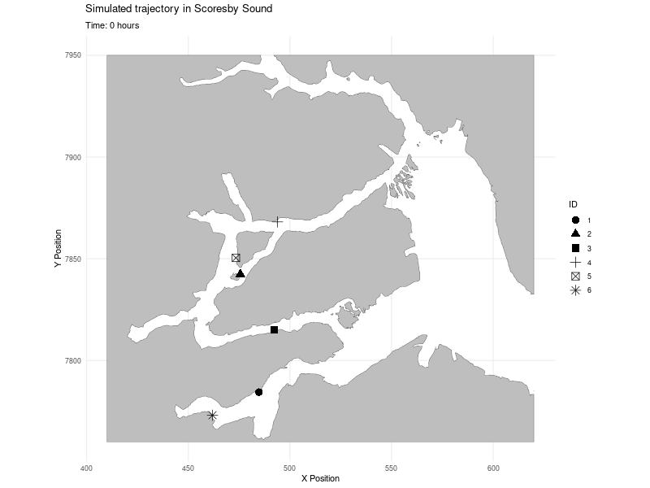

```{r setup, include=FALSE}
knitr::opts_chunk$set(echo = TRUE)
```

In this document, we simulate from constrained correlated velocity models with smooth parameters $omega$ and $tau$. The smooth functions will be parametric and the parameters will have direct interpretation in terms of movement.

# Set up

```{r set up}
cat("\014")                 # Clears the console


#seed for reproducibility 
seed=42

#parallel computing
library(foreach)
library(doParallel)

#for pipeline operator
library(dplyr)

#plots
library(ggplot2)
library(plotly)
library(htmlwidgets)
library(ggpubr)

#data managing
library(tidyr)

#progress bar
library(progress)

#for land polygons
library(sf)

#for spline estimation
library(mgcv)

#to get root of git repo
library(here)

#animated trajectories
library(gganimate)

#get functions to simulate trajectories
source(file.path(here("R","simulation_study_CRCVM","CVM_functions.R")))  


```

# Define initial velocity and location for trajectories

```{r initial velocity and positions}
set.seed(seed)
# Initial velocity and location in fjords -------------

# Set the path to the directory containing the data
greenland_data_path <- here("Data","preprocessed_data","greenland")

#get the land and coastline geometries from the geojson file
land_border<-st_read(file.path(greenland_data_path,"updated_scoresby_sound_utm.shp"))


land_border <- st_transform(land_border, crs = "+init=EPSG:32626 +units=km")


v0=c(0,0)

#generate random initial points
x0=matrix(rep(NA,12),ncol=2)
colnames(x0)=c("x1","x2")

N=6 #number of trajectories
i=1
while (i<=N) {
  #choose location uniformly in the map
  x=c(runif(1,min=430,max=510),runif(1,min=7760,max=7900))
  p=nearest_shore_point(st_point(x),land_border)
  Dshore=(x[1]-p[1])^2+(x[2]-p[2])^2
  if (Dshore<1.5 && Dshore >0.3) {
    x0[i,]=x
    i=i+1
  }
}
```

# Define domains

```{r rectangular domain}

# Rectangular domain around the initial location ---------------------

x.max=max(x0[,1])+5
x.min=min(x0[,1])-5
y.max=max(x0[,2])+5
y.min=min(x0[,2])-5

large_rectangle_coords <- matrix(c(x.min, y.min, x.min, y.max, x.max, y.max, x.max, y.min, x.min,  y.min), ncol = 2, byrow = TRUE)
small_rectangle_coords <- matrix(c(x.min+1, y.min+1, x.min+1, y.max-1, x.max-1, y.max-1, x.max-1, y.min+1, x.min+1,  y.min+1), ncol = 2, byrow = TRUE)
  

# Create an sf object representing the rectangles
large_rectangle <- st_sfc(st_polygon(list(large_rectangle_coords)))
large_rectangle<-st_sf(geometry = large_rectangle)

small_rectangle <- st_sfc(st_polygon(list(small_rectangle_coords)))
small_rectangle<-st_sf(geometry = small_rectangle)

#change its crs
rect_border<- st_sym_difference(large_rectangle, small_rectangle)


```

```{r circular domain}

# Circular domain around the initial position -------
middle=c(mean(x0[,1]),mean(x0[,2]))

# Create circle geometries
large_circle <- st_buffer(st_sfc(st_point(middle)), dist = 55)
small_circle <- st_buffer(st_sfc(st_point(middle)), dist = 54)

# Convert circles to polygons
large_circle_polygon <- st_cast(large_circle, "POLYGON")
small_circle_polygon <- st_cast(small_circle, "POLYGON")

# Create sf objects
large_circle_sf <- st_sf(geometry = large_circle_polygon)
small_circle_sf <- st_sf(geometry = small_circle_polygon)

# Calculate the symmetric difference to get the border
circ_border <- st_sym_difference(large_circle_sf, small_circle_sf)

```

```{r circular domains with islands}


#### Circular domain with islands

# Create small circles borders within the big circle
circle1 <- st_buffer(st_sfc(st_point(middle-c(15,0))), dist = 10)

# Convert circles to polygons
circle_polygon1 <- st_cast(circle1, "POLYGON")


# Create sf objects
circle_sf1 <- st_sf(geometry = circle_polygon1)


# Create small circles borders within the big circle
circle2 <- st_buffer(st_sfc(st_point(middle-c(0,15))), dist = 10)

# Convert circles to polygons
circle_polygon2 <- st_cast(circle2, "POLYGON")


# Create sf objects
circle_sf2 <- st_sf(geometry = circle_polygon2)

circ_island_border <- st_union(st_union(circ_border, circle_sf1), circle_sf2)


```

```{r plot domains}

# Plot using ggplot2
ggplot() +
  # Rectangular border
  geom_sf(data = rect_border, fill = "lightblue", color = "black") +
  ggtitle("Rectangular Border") +
  theme_minimal()

ggplot() +
  # Circular border
  geom_sf(data = circ_border, fill = "lightgreen", color = "black") +
  ggtitle("Circular Border") +
  theme_minimal()

ggplot() +
  # Circular domain with islands
  geom_sf(data = circ_island_border, fill = "lightcoral", color = "black") +
  ggtitle("Circular Border with Islands") +
  theme_minimal()
```

# Define parametric functions for smooth parameters $\tau$

First define the function for a constant value of $\tau$. By default, we set this value to $2$ h.

```{r function for constant tau}


#constant tau
ftau_constant=function(cov_data,tau=2) {
  return (tau)
}


```

Then we define smooth functions of the angle $\theta$ to model higher persistence along the shoreline. The function need to have bumps around $\frac{\pi}{2}$ and $-\frac{\pi}{2}$. This type of function can be obtained in multiple ways, using hyperbolic tangent or gaussian bumps for instance. We give an example with hyperbolic tangent.

```{r tanh tau}

ftau_tanh=function(cov_data,alpha=1,tau0=0.5,tau1=4) {
  #cov_data : dataframe of covariate with column for angle theta
  #alpha : steepness of the bump
  #tau0 : base value of tau
  #tau1 : maximum value of tau
  epsilon=0.1
  theta=cov_data$theta
  tau=tau0+(tau1-tau0)/2/tanh(epsilon/alpha)*(tanh((theta+(pi/2+epsilon))/alpha)-tanh((theta+(pi/2-epsilon))/alpha))+
         (tau1-tau0)/2/tanh(epsilon/alpha)*(tanh((theta+-pi/2+epsilon)/alpha)-tanh((theta-pi/2-epsilon)/alpha))
  
  return (tau)
}


```

```{r plot tanh tau tau1}
# Plot curves for different values of tau1
tau1_values <- c(2,4)

cov_data=data.frame("theta"=seq(from=-pi+0.1,to=pi-0.1,length.out=100))

plot_data_tau1 <- data.frame(
  theta = rep(cov_data$theta, times = length(tau1_values)),
  tau1 = rep(tau1_values, each = length(cov_data$theta)))
plot_data_tau1$tau=unlist(lapply(tau1_values,function(tau1) {ftau_tanh(cov_data,tau1=tau1)}))
# Plot using ggplot
ggplot(plot_data_tau1, aes(x = theta, y = tau, color = as.factor(tau1))) +
  geom_line() +
 ylab(expression(tau)) + 
  xlab(expression(Theta)) + 
  geom_vline(xintercept = c(-pi/2, pi/2), linetype = "dashed", color = "black") + 
  annotate("text", x = -pi/2-0.3, y = 0.3, label = expression(-pi/2), color = "black", size = 6) + 
  annotate("text", x = pi/2+0.2, y = 0.3, label = expression(pi/2), color = "black", size = 6) + 
  scale_color_manual(values = c("blue", "red"), 
                     labels = c("tau1 = 2", "tau1 = 4"))+
  theme_minimal() +
  theme(
    axis.title = element_text(size = 18, face = "bold"),
    axis.text = element_text(size = 12, face = "bold"),
    axis.text.x = element_blank(),  # Remove x-axis text
    axis.ticks.x = element_blank(),  # Remove x-axis ticks
    axis.title.y = element_text(angle = 0)  # Rotate the y-axis label and adjust horizontal justification
  )

```

```{r plot tanh tau alpha}
# Plot curves for different values of alpha
alpha_values<-c(0.5,1)

plot_data_alpha <- data.frame(
  theta = rep(cov_data$theta, times = length(tau1_values)),
  alpha = rep(alpha_values, each = length(cov_data$theta)))
plot_data_alpha$tau=unlist(lapply(alpha_values,function(alpha) {ftau_tanh(cov_data,alpha=alpha)}))
# Plot using ggplot
ggplot(plot_data_alpha, aes(x = theta, y = tau, color = as.factor(alpha))) +
  geom_line() +
 ylab(expression(tau)) + 
  xlab(expression(Theta)) + 
  geom_vline(xintercept = c(-pi/2, pi/2), linetype = "dashed", color = "black") + 
  annotate("text", x = -pi/2-0.3, y = 0.3, label = expression(-pi/2), color = "black", size = 6) + 
  annotate("text", x = pi/2+0.2, y = 0.3, label = expression(pi/2), color = "black", size = 6) + 
  scale_color_manual(values = c("blue", "red"), 
                     labels = c("alpha = 0.5", "alpha = 1"))+
  theme_minimal() +
  theme(
    axis.title = element_text(size = 18, face = "bold"),
    axis.text = element_text(size = 12, face = "bold"),
    axis.text.x = element_blank(),  # Remove x-axis text
    axis.ticks.x = element_blank(),  # Remove x-axis ticks
    axis.title.y = element_text(angle = 0)  # Rotate the y-axis label and adjust horizontal justification
  )

```

However this parametrization is quite complex and we can do better and easier with gaussian bumps.

```{r define tau gaussian}

ftau_gaussian=function(cov_data,sigma_bump=0.3,sigma_dip=0.5,tau0=1,dtau_bump=1,dtau_dip=0.5) {
  #cov_data : dataframe of covariates with column for angle theta
  #sigma_bump : width of the bumps at -pi/2 and pi/2
  #sigma_dip : width of the dip at 0
  #tau0 : base value of tau
  #dtau_bump : height of the bump
  #dtau_dip : depth of the dip
  
  theta=cov_data$theta
  bump1 <- dtau_bump*exp(-((theta - pi/2)^2) / (2 * sigma_bump^2))
  bump2 <- dtau_bump*exp(-((theta + pi/2)^2) / (2 * sigma_bump^2))
  dip<- dtau_dip*exp(-((theta)^2) / (2 * sigma_dip^2))
  tau=tau0+bump1+bump2-dip
  
  return (tau)
}


```

```{r plot tau gaussian dtau_bump}
dtau_bump_values=c(1,3)


plot_data_dtau <- data.frame(
  theta = rep(cov_data$theta, times = length(dtau_bump_values)),
  dtau = rep(dtau_bump_values, each = length(cov_data$theta)))
plot_data_dtau$tau=unlist(lapply(dtau_bump_values,function(dtau) {ftau_gaussian(cov_data,dtau_bump=dtau)}))


#ggplot for tau
plot_tau_gaussian_dtau <- ggplot(data=plot_data_dtau) + 
  geom_line(aes(x = theta, y = tau,color = as.factor(dtau))) + 
  ylab(expression(tau)) + 
  xlab(expression(Theta)) + 
  geom_vline(xintercept = c(-pi/2, pi/2), linetype = "dashed", color = "black") + 
  annotate("text", x = -pi/2-0.3, y = 0.3, label = expression(-pi/2), color = "black", size = 6) + 
  annotate("text", x = pi/2+0.2, y = 0.3, label = expression(pi/2), color = "black", size = 6) + 
  scale_color_manual(values = c("blue", "red"), 
                     labels = c("dtau_bump = 1", "dtau_bump = 3"))+
  theme_minimal() +
  theme(
    axis.title = element_text(size = 18, face = "bold"),
    axis.text = element_text(size = 12, face = "bold"),
    axis.text.x = element_blank(),  # Remove x-axis text
    axis.ticks.x = element_blank(),  # Remove x-axis ticks
    axis.title.y = element_text(angle = 0)  # Rotate the y-axis label and adjust horizontal justification
  )


plot_tau_gaussian_dtau

```

```{r plot tau gaussian sigma_bump}
sigma_bump_values=c(0.2,0.4)


plot_data_sigma_bump <- data.frame(
  theta = rep(cov_data$theta, times = length(sigma_bump_values)),
  sigma = rep(sigma_bump_values, each = length(cov_data$theta)))
plot_data_sigma_bump$tau=unlist(lapply(sigma_bump_values,function(sigma) {ftau_gaussian(cov_data,sigma_bump=sigma)}))


#ggplot for tau
plot_tau_gaussian_sigma <- ggplot(data=plot_data_sigma_bump) + 
  geom_line(aes(x = theta, y = tau,color = as.factor(sigma))) + 
  ylab(expression(tau)) + 
  xlab(expression(Theta)) + 
  geom_vline(xintercept = c(-pi/2, pi/2), linetype = "dashed", color = "black") + 
  annotate("text", x = -pi/2-0.3, y = 0.3, label = expression(-pi/2), color = "black", size = 6) + 
  annotate("text", x = pi/2+0.2, y = 0.3, label = expression(pi/2), color = "black", size = 6) + 
  scale_color_manual(values = c("blue", "red"), 
                     labels = c("sigma_bump = 0.2", "sigma_bump = 0.4"))+
  theme_minimal() +
  theme(
    axis.title = element_text(size = 18, face = "bold"),
    axis.text = element_text(size = 12, face = "bold"),
    axis.text.x = element_blank(),  # Remove x-axis text
    axis.ticks.x = element_blank(),  # Remove x-axis ticks
    axis.title.y = element_text(angle = 0)  # Rotate the y-axis label and adjust horizontal justification
  )

plot_tau_gaussian_sigma
```

# Define parametric functions for smooth parameter $\omega$


The parameter $\omega$ will drive how the process rotates depending on the current distance to the boundary and the current angle. It is crucial to rotate fast enough and in the right direction to avoid hitting the boundary. Obviously, what we mean by "fast enough" and "right direction" depends on the shape of the boundary. What is fast enough for a smooth boundary might not be fast enough in a corner for instance. $\vert \omega \vert$ should increase fast as $\vert \theta \vert$ ranges through $\left[ \frac{\pi}{2},\pi \right]$. The sign of $\omega$ depends on the sign of $\theta$. For positive angles $\theta \in \left[ \frac{\pi}{2},\pi \right]$, we need the velocity to rotate in the inverse trigonometric sense. Since the rotation induced in the velocity during $\Delta$ hours is $-\omega \Delta$, this means that we need a positive $\omega$ to effectively rotate in the inverse trigonometric sense. Similarly, for negative $\theta \in \left[ -\pi,-\frac{\pi}{2} \right]$, we need a negative $\omega$.

This type of behavior can be obtained with hyperbolic tangent function.

```{r parametric tanh function for omega}

fomega_tanh=function(cov_data,D0=0.5,omega0=60*pi/2,lambda=2,kappa=0.2) {
  Dshore=cov_data$DistanceShore
  theta=cov_data$theta
  if (is.null(Dshore)){
    Dshore=1/cov_data$ExpShore
  }
  coeff=exp(-kappa*(Dshore/D0)^2)
  omega=omega0/2*(tanh(lambda*(theta+pi/2-atanh(-0.9)/lambda))+tanh(lambda*(theta-(pi/2-atanh(-0.9)/lambda))))*coeff
  return(omega)
}


```

```{r plot omega tanh}

#grid 
Dshore=seq(from=0.05,to=4,length.out=30)
theta=seq(from=-pi+0.1,to=pi-0.1,length.out=30)
grid<- as.data.frame(expand.grid(Dshore,theta))
colnames(grid)=c("DistanceShore","theta")

#smooth omega
omega_tanh=matrix(fomega_tanh(grid),30,30)


# dynamic plots for omega 

plot_omega_tanh <- plot_ly(type = "surface",
                           contours = list(z = list(show = TRUE, start = min(omega_tanh), end = max(omega_tanh), size = 5,color="black")),
                           x = ~theta,y = ~Dshore,z=~omega_tanh,
                           colors=colorRamp(c("blue", "lightblue", "chartreuse3", "yellow", "red")))%>%
  layout(title=paste("Omega"),
         scene=list(xaxis = list(title = "Theta",showgrid = F),
                    yaxis = list(title = "Distance to shore",showgrid = F),zaxis = list(title = "omega"))) 


plot_omega_tanh
```


A similar smooth function may also be obtained with the inverse of a square root near $-\pi$ and $\pi$.

```{r define omega  sqrt}

fomega_sqrt <- function(cov_data, a=10*pi, p = 2,D0=0.5) {
  
  Dshore=cov_data$DistanceShore
  theta=cov_data$theta
  if (is.null(Dshore)){
    Dshore=1/cov_data$Ishore
  }
  
  epsilon <- pmax(0, Dshore - D0)^2  # Damping term
  ifelse(
    abs(theta) <= pi / 2,
    0,  # Flat in the middle
    sign(theta) * a * ((abs(theta) - pi / 2)^p) /
      sqrt((pi - abs(theta)) + epsilon)
  )
}


```

```{r plot omega sqrt}
#smooth omega
omega_sqrt=matrix(fomega_sqrt(grid),30,30)


# dynamic plots for omega 

plot_omega_sqrt <- plot_ly(type = "surface",
                           contours = list(z = list(show = TRUE, start = min(omega_sqrt), end = max(omega_sqrt), size = 5,color="black")),
                           x = ~theta,y = ~Dshore,z=~omega_sqrt,
                           colors=colorRamp(c("blue", "lightblue", "chartreuse3", "yellow", "red")))%>%
  layout(title=paste("Omega"),
         scene=list(xaxis = list(title = "Theta",showgrid = F),
                    yaxis = list(title = "Distance to shore",showgrid = F),zaxis = list(title = "omega"))) 


plot_omega_sqrt
```

These smooth functions $\omega$ can produce a SDE model that is constrained within a restricted domain of $\R^2$.
The trajectories avoid the shoreline, but are not attracted to it. To model a tendecy to follow the shoreline, we need to modify a bit the smooth function to get a rotation of the velocity toward the shore when it is on the verge of leaving it. We can do this in several ways. 
First, we use a sin function.


```{r define and plot omega sin}
# Define the extended function f(theta)
fomega_sin<- function(cov_data, a =4*pi,b=80*pi,D0=0.8) {
  Dshore=cov_data$DistanceShore
  theta=cov_data$theta
  if (is.null(Dshore)){
    Dshore=1/cov_data$Ishore
  }
  ifelse(abs(theta) < pi/2, 
         -a * sin(2*theta)*exp(-(Dshore/D0)^2),
         ifelse(theta>0,
               sign(theta)*b*abs(theta-pi/2)^2*exp(-(Dshore/D0)^2),
               sign(theta)*b*abs(theta+pi/2)^2*exp(-(Dshore/D0)^2)))
}


#smooth omega
omega_sin=matrix(fomega_sin(grid),30,30)


# dynamic plots for omega 

plot_omega_sin <- plot_ly(type = "surface",
                           contours = list(z = list(show = TRUE, start = min(omega_sin), end = max(omega_sin), size = 5,color="black")),
                           x = ~theta,y = ~Dshore,z=~omega_sin,
                           colors=colorRamp(c("blue", "lightblue", "chartreuse3", "yellow", "red")))%>%
  layout(title=paste("Omega"),
         scene=list(xaxis = list(title = "Theta",showgrid = F),
                    yaxis = list(title = "Distance to shore",showgrid = F),zaxis = list(title = "omega"))) 


plot_omega_sin

```


Now we use a cubic polynomial with an additional gaussian kernel.

```{r}
fomega_cubic=function(cov_data,a=1,D0=0.3,D1=0.8,sigma_theta=pi/8,sigma_D=0.2,b=5){
  Dshore=cov_data$DistanceShore
  theta=cov_data$theta
  if (is.null(Dshore)){
    Dshore=1/cov_data$Ishore
  }
  
  a*theta*(theta-pi/2)*(theta+pi/2)*exp(-Dshore/D0)/Dshore+
      b*(exp(-1/2*(theta+pi/2/sqrt(3))^2/sigma_theta^2)-
           exp(-1/2*(theta-pi/2/sqrt(3))^2/(sigma_theta)^2))*exp(-1/2*(Dshore-D1)^2/sigma_D^2)
}


#smooth omega
omega_cubic=matrix(fomega_cubic(grid),30,30)


# dynamic plots for omega 

plot_omega_cubic <- plot_ly(type = "surface",
                           contours = list(z = list(show = TRUE, start = min(omega_cubic), end = max(omega_cubic), size = 5,color="black")),
                           x = ~theta,y = ~Dshore,z=~omega_cubic,
                           colors=colorRamp(c("blue", "lightblue", "chartreuse3", "yellow", "red")))%>%
  layout(title=paste("Omega"),
         scene=list(xaxis = list(title = "Theta",showgrid = F),
                    yaxis = list(title = "Distance to shore",showgrid = F),zaxis = list(title = "omega"))) 


plot_omega_cubic
```

We can also geometrically compute what should be the angular veolcity to avoid land. And we get the expression of $\omega$ like this.

```{r}


fomega_minimal=function(cov_data,nu=4,D0=0.5,D1=1.5,a=1,b=10,sigma_D=0.5,sigma_theta=pi/8) {
  Dshore=cov_data$DistanceShore
  theta=cov_data$theta
  ifelse(abs(theta)>pi/2,a*sign(theta)*(pi/2-abs(theta))*nu*cos(theta)/Dshore*exp(-Dshore/D0),-sign(theta)*b*
    exp(-1/2*(theta-sign(theta)*pi/4)^2/sigma_theta^2)*exp(-Dshore/D1))
}


#smooth omega
omega_minimal=matrix(fomega_minimal(grid),30,30)


# dynamic plots for omega 

plot_omega_minimal <- plot_ly(type = "surface",
                           contours = list(z = list(show = TRUE, start = min(omega_minimal), end = max(omega_minimal), size = 5,color="black")),
                           x = ~theta,y = ~Dshore,z=~omega_minimal,
                           colors=colorRamp(c("blue", "lightblue", "chartreuse3", "yellow", "red")))%>%
  layout(title=paste("Omega"),
         scene=list(xaxis = list(title = "Theta",showgrid = F),
                    yaxis = list(title = "Distance to shore",showgrid = F),zaxis = list(title = "omega"))) 


plot_omega_minimal
```

We can approximate these surfaces using tensor splines

```{r approximate tanh omega with splines}
# Splines smooth for omega -------------------- 
n <- 100000
SP_DF=5

#sample theta and DistanceShore points in the domain
theta <- runif(n,-pi,pi);
DistanceShore <- runif(n,0.2,8);
samples=data.frame(theta=theta,DistanceShore=DistanceShore)

#define grid of values
theta_v <- seq(-pi,pi,length=30)
Dshore_v<- seq(0.2,8,length=30)
pr <- data.frame(theta=rep(theta_v,30),DistanceShore=rep(Dshore_v,rep(30,30)))


#points on the surface perturbed by gaussian noise
f <- fomega_tanh(samples)
y <- f+0.1*rnorm(n)


#fit with bivariate splines te
m1 <- gam(y~te(theta,DistanceShore,k=SP_DF),knots=list(theta=seq(-pi,pi,len=SP_DF),
                                                       DistanceShore=seq(0.2,8,len=SP_DF)))

ExpShore=1/DistanceShore

#fit with bivariate splines te
m2 <- gam(y~te(theta,ExpShore,k=SP_DF),knots=list(theta=seq(-pi,pi,len=SP_DF),
                                                  ExpShore=seq(1/8,1/0.2,len=SP_DF)))


fomega_tanh_splines=function(cov_data) {
  
  if (is.null(cov_data$ExpShore)){
    omega=predict(m1,newdata=cov_data)
  }
  else if (is.null(cov_data$DistanceShore)){
    omega=predict(m2,newdata=cov_data)
  }
  
  return(as.numeric(omega))
}

```


```{r plot tanh parametric and spline omega}

# Perspective plots for omega

# Grid 
Dshore = seq(from = 0, to = 2, length.out = 30)
theta = seq(from = -pi + 0.1, to = pi - 0.1, length.out = 30)
grid <- as.data.frame(expand.grid(Dshore, theta))
colnames(grid) = c("DistanceShore", "theta")

# Smooth omega
z = matrix(fomega_cubic_advanced(grid), 30, 30)

# Create a function interpolating colors in the range of specified colors
jet.colors <- colorRampPalette( c("blue", "green") )
# Generate the desired number of colors from this palette
nbcol <- 100
color <- jet.colors(nbcol)
# Compute the z-value at the facet centres
ncz=ncol(z)
nrz=nrow(z)
zfacet <- z[-1, -1] + z[-1, -ncz] + z[-nrz, -1] + z[-nrz, -ncz]
# Recode facet z-values into color indices
facetcol <- cut(zfacet, nbcol)

# Open PNG device 
png(file.path("perspective_plots.png"), width = 1000, height = 500)  

par(mfrow = c(1, 2), mar = c(3, 3, 3, 3))  #

# First plot
res=persp(Dshore, theta, z, 
      phi = 15,
      axes = FALSE,
      col = color[facetcol], 
      cex.lab = 1.5, 
      ticktype = "simple",
      xlim = c(min(Dshore), max(Dshore)),  # Explicit xlim
      ylim = c(min(theta), max(theta)))


#lines(trans3d(seq(0.05,2,length.out=5), y = rep(-pi+0.1,5), z = rep(min(z),5), pmat = res), col = "black")
lines(trans3d(rep(1,5), y = rep(-pi+0.1,5), z = seq(min(z)-20,min(z)+1030,5), pmat = res), col = "grey",lty=2)
lines(trans3d(rep(0.5,5), y = rep(-pi+0.1,5), z = seq(min(z)-20,min(z)+1030,5), pmat = res), col = "grey",lty=2)
lines(trans3d(rep(0.1,5), y = rep(-pi+0.1,5), z = seq(min(z)-20,min(z)+1030,5), pmat = res), col = "grey",lty=2)

text(trans3d(0.1, -pi + 0.05, min(z)+30, pmat = res), labels = "0.1", pos = 4, cex = 1.2, col = "black")  # Line 4
text(trans3d(0.5, -pi + 0.05, min(z)+30, pmat = res), labels = "0.5", pos = 4, cex = 1.2, col = "black")  # Line 2
text(trans3d(1, -pi + 0.05, min(z)+30, pmat = res), labels = "1", pos = 4, cex = 1.2, col = "black")  # Line 3


mtext(expression(D^{shore}), side = 1, line = -2, cex = 1.5)
mtext(expression(omega), side = 2, line = 1, cex = 1.5, las = 2)


# Second plot
persp(Dshore, theta, z, 
      phi = 15,theta=-90,
      axes = FALSE,
      col = color[facetcol], 
      cex.lab = 1.5,  #
      ticktype = "simple")
mtext(expression(Theta), side = 1, line = -2, cex = 1.5)
mtext(expression(omega), side = 2, line = 1, cex = 1.5, las = 2)


#lines(trans3d(seq(0.05,2,length.out=5), y = rep(-pi+0.1,5), z = rep(min(z),5), pmat = res), col = "black")
lines(trans3d(rep(0.5,5), y = rep(-pi+0.1,5), z = seq(min(z)-20,min(z)+1030,5), pmat = res), col = "grey",lty=2)
lines(trans3d(rep(1,5), y = rep(-pi+0.1,5), z = seq(min(z)-20,min(z)+1030,5), pmat = res), col = "grey",lty=2)
lines(trans3d(rep(1.5,5), y = rep(-pi+0.1,5), z = seq(min(z)-20,min(z)+1030,5), pmat = res), col = "grey",lty=2)

text(trans3d(0.5,-pi+0.05, min(z)+30, pmat = res), labels = expression(-pi/2), pos = 4, cex = 1.2, col = "black") 
text(trans3d(1, -pi + 0.05, min(z)+30, pmat = res), labels = "0", pos = 4, cex = 1.2, col = "black")  
text(trans3d(1.5, -pi + 0.05, min(z)+30, pmat = res), labels = expression(pi/2), pos = 4, cex = 1.2, col = "black") 

dev.off()

```


We will keep the velocity parameter $\nu$ constant in our simulations.

```{r constant function for nu}

#constant nu
fnu_constant=function(cov_data,nu=4) {
  return (nu)
}
```

# Trajectories in a rectangular domain.

To start we inspect what the trajectories look like in the rectangular domain. 
We will try the different parametric function that we used before.

We simulate over 3 days with a constant time step equal to 10 seconds.

```{r set time steps for simulation}
TMAX=3*24
dt=1/360
times=seq(0,TMAX,by=dt)

```


```{r simulate with omega tanh in rectangle,cache=TRUE}
# CRCVM with tanh smooth omega


# Generate samples ---------------
cores=detectCores()
cl <- makeCluster(6) #not to overload your computer
registerDoParallel(cl)


data_sim_rect_tanh=foreach (i=1:N,.combine='rbind',.packages=c("progress","MASS","sf","mgcv")) %dopar% {
  
  set.seed((seed-1)*N+i)
  
  res=sim_CRCVM(ftau=ftau_constant,fomega=fomega_minimal,fnu=fnu_constant,v0=v0,x0=x0[i,],
                    times=times,land=rect_border,verbose=FALSE)
  
  data_sim=res$sim
  data_sim$ID=factor(rep(i,length(data_sim$y1)))
  data_shore=res$shore[,c("p1","p2")]
  cbind(data_sim,data_shore)
}

#stop cluster
stopCluster(cl)

```

```{r}


#subsample to 10 minutes
data_sim_rect_tanh_sub=data_sim_rect_tanh[seq(1,length(data_sim_rect_tanh$y1),by=60),]

ggplot() +
    geom_sf(data = rect_border$geometry, fill = "grey", inherit.aes = FALSE) +
    coord_sf(datum = st_crs("+init=EPSG:32626 +units=km")) +
    geom_path(data = data_sim_rect_tanh_sub, aes(x = y1, y = y2, col = ID), size = 0.1) +
    geom_point(data = data_sim_rect_tanh_sub, aes(x = y1, y = y2, col = ID), size = 0.1) +
    geom_point(data = x0, aes(x = x1, y = x2), shape = 3, size = 2, col = "red") +
    theme_minimal() +
    xlab("x") + ylab("y") +
    theme(legend.position = "none") 
```

The process is avoiding land by rotating when it approaches the boundary. 
Now, to have trajectories that tends to remain close to the boundary and move along it we can use the function \texttt{fomega_cubic} instead.

```{r simulate with omega cubic in rectangle,cache=TRUE}

fomega_cubic_rect_attractive=function(cov_data) {
  
  fomega_cubic(cov_data,a=3,D0=0.5,D1=1.5,sigma_theta=pi/8,sigma_D=0.5,b=5)
  
}
  
# Generate samples ---------------
cores=detectCores()
cl <- makeCluster(6) #not to overload your computer
registerDoParallel(cl)


data_sim_rect_cubic_attractive=foreach (i=1:N,.combine='rbind',.packages=c("progress","MASS","sf","mgcv")) %dopar% {
  
  set.seed((seed-1)*N+i)
  
  res=sim_CRCVM(ftau=ftau_constant,fomega=fomega_cubic_rect_attractive,fnu=fnu_constant,v0=v0,x0=x0[i,],
                    times=times,land=rect_border,verbose=FALSE)
  
  data_sim=res$sim
  data_sim$ID=factor(rep(i,length(data_sim$y1)))
  data_shore=res$shore[,c("p1","p2")]
  cbind(data_sim,data_shore)
}

#stop cluster
stopCluster(cl)

```

```{r}

#subsample to 10 minutes
data_sim_rect_cubic_attractive_sub=data_sim_rect_cubic_attractive[seq(1,length(data_sim_rect_cubic_attractive$y1),by=60),]

ggplot() +
    geom_sf(data = rect_border$geometry, fill = "grey", inherit.aes = FALSE) +
    coord_sf(datum = st_crs("+init=EPSG:32626 +units=km")) +
    geom_path(data = data_sim_rect_cubic_attractive_sub, aes(x = y1, y = y2, col = ID), size = 0.1) +
    geom_point(data = data_sim_rect_cubic_attractive_sub, aes(x = y1, y = y2, col = ID), size = 0.1) +
    geom_point(data = x0, aes(x = x1, y = x2), shape = 3, size = 2, col = "red") +
    theme_minimal() +
    xlab("x") + ylab("y") +
    theme(legend.position = "none") 
```

We remove the attractive term in the function by taking parameter $b=0$.


```{r simulate with omega cubic in rectangle,cache=TRUE}

fomega_cubic_rect_repulsive=function(cov_data) {
  
  fomega_cubic(cov_data,a=2,D0=0.5,D1=1.5,sigma_theta=pi/10,sigma_D=0.5,b=0)
  
}
  
# Generate samples ---------------
cores=detectCores()
cl <- makeCluster(6) #not to overload your computer
registerDoParallel(cl)


data_sim_rect_cubic_repulsive=foreach (i=1:N,.combine='rbind',.packages=c("progress","MASS","sf","mgcv")) %dopar% {
  
  set.seed((seed-1)*N+i)
  
  res=sim_CRCVM(ftau=ftau_constant,fomega=fomega_cubic_rect_repulsive,fnu=fnu_constant,v0=v0,x0=x0[i,],
                    times=times,land=rect_border,verbose=FALSE)
  
  data_sim=res$sim
  data_sim$ID=factor(rep(i,length(data_sim$y1)))
  data_shore=res$shore[,c("p1","p2")]
  cbind(data_sim,data_shore)
}

#stop cluster
stopCluster(cl)

```


```{r}

#subsample to 10 minutes
data_sim_rect_cubic_repulsive_sub=data_sim_rect_cubic_repulsive[seq(1,length(data_sim_rect_cubic_repulsive$y1),by=60),]

ggplot() +
    geom_sf(data = rect_border$geometry, fill = "grey", inherit.aes = FALSE) +
    coord_sf(datum = st_crs("+init=EPSG:32626 +units=km")) +
    geom_path(data = data_sim_rect_cubic_repulsive_sub, aes(x = y1, y = y2, col = ID), size = 0.1) +
    geom_point(data = data_sim_rect_cubic_repulsive_sub, aes(x = y1, y = y2, col = ID), size = 0.1) +
    geom_point(data = x0, aes(x = x1, y = x2), shape = 3, size = 2, col = "red") +
    theme_minimal() +
    xlab("x") + ylab("y") +
    theme(legend.position = "none") 
```

```{r simulate with omega minimal in rectangle,cache=TRUE}

fomega_minimal_rect_attractive=function(cov_data) {
  
  fomega_minimal(cov_data,nu=4,D0=0.5,D1=1.5,a=3,b=10,sigma_D=0.5,sigma_theta=pi/8)
}
  
# Generate samples ---------------
cores=detectCores()
cl <- makeCluster(6) #not to overload your computer
registerDoParallel(cl)


data_sim_rect_minimal_attractive=foreach (i=1:N,.combine='rbind',.packages=c("progress","MASS","sf","mgcv")) %dopar% {
  
  set.seed((seed-1)*N+i)
  
  res=sim_CRCVM(ftau=ftau_constant,fomega=fomega_minimal_rect_attractive,fnu=fnu_constant,v0=v0,x0=x0[i,],
                    times=times,land=rect_border,verbose=FALSE)
  
  data_sim=res$sim
  data_sim$ID=factor(rep(i,length(data_sim$y1)))
  data_shore=res$shore[,c("p1","p2")]
  cbind(data_sim,data_shore)
}

#stop cluster
stopCluster(cl)

```

```{r}

#subsample to 10 minutes
data_sim_rect_minimal_attractive_sub=data_sim_rect_minimal_attractive[seq(1,length(data_sim_rect_minimal_attractive$y1),by=60),]

ggplot() +
    geom_sf(data = rect_border$geometry, fill = "grey", inherit.aes = FALSE) +
    coord_sf(datum = st_crs("+init=EPSG:32626 +units=km")) +
    geom_path(data = data_sim_rect_minimal_attractive_sub, aes(x = y1, y = y2, col = ID), size = 0.1) +
    geom_point(data = data_sim_rect_minimal_attractive_sub, aes(x = y1, y = y2, col = ID), size = 0.1) +
    geom_point(data = x0, aes(x = x1, y = x2), shape = 3, size = 2, col = "red") +
    theme_minimal() +
    xlab("x") + ylab("y") +
    theme(legend.position = "none") 
```


Until now, we kept the parameter $\tau$ constant. We can emphasize the tendency to move along the boundary by using a smooth $\tau$ given by the functions \texttt{ftau_tanh} or \texttt{ftau_gaussian}. Here, we plot trajectories for the SDE model where the smoth $\omega$ parameter is given by \texttt{fomega_cubic} and the smooth $\tau$ parameter is given by \texttt{ftau\_gaussian}.

```{r simulate with omega cubic tau gaussian in rectangle,cache=TRUE}


# Generate samples ---------------
cores=detectCores()
cl <- makeCluster(6) #not to overload your computer
registerDoParallel(cl)


data_sim_rect_cubic_gaussian_attractive=foreach (i=1:N,.combine='rbind',.packages=c("progress","MASS","sf","mgcv")) %dopar% {
  
  set.seed((seed-1)*N+i)
  
  res=sim_CRCVM(ftau=ftau_gaussian,fomega=fomega_cubic_rect_attractive,fnu=fnu_constant,v0=v0,x0=x0[i,],
                    times=times,land=rect_border,verbose=FALSE)
  
  data_sim=res$sim
  data_sim$ID=factor(rep(i,length(data_sim$y1)))
  data_shore=res$shore[,c("p1","p2")]
  cbind(data_sim,data_shore)
}

#stop cluster
stopCluster(cl)

```

```{r}
#subsample to 10 minutes
data_sim_rect_cubic_gaussian_attractive_sub=data_sim_rect_cubic_gaussian_attractive[seq(1,length(data_sim_rect_cubic_gaussian_attractive$y1),by=60),]

ggplot() +
    geom_sf(data = rect_border$geometry, fill = "grey", inherit.aes = FALSE) +
    coord_sf(datum = st_crs("+init=EPSG:32626 +units=km")) +
    geom_path(data = data_sim_rect_cubic_gaussian_attractive_sub, aes(x = y1, y = y2, col = ID), size = 0.1) +
    geom_point(data = data_sim_rect_cubic_gaussian_attractive_sub, aes(x = y1, y = y2, col = ID), size = 0.1) +
    geom_point(data = x0, aes(x = x1, y = x2), shape = 3, size = 2, col = "red") +
    theme_minimal() +
    xlab("x") + ylab("y") +
    theme(legend.position = "none") 
```


Finally, we compare it to Hanks simulation technique for reflected SDE.

```{r simulate hanks reflected in rectangle,cache=TRUE}


# Generate samples ---------------
cores=detectCores()
cl <- makeCluster(6) #not to overload your computer
registerDoParallel(cl)


data_sim_rect_hanks=foreach (i=1:N,.combine='rbind',.packages=c("progress","MASS","sf","mgcv")) %dopar% {
  
  set.seed((seed-1)*N+i)
  
  data_sim=sim_HANKSreflected(mu1=0,mu2=0,beta=0.5,sigma=8/sqrt(pi*2),x0[i,],v0,dt,TMAX,land=rect_border)
  data_sim$ID=factor(rep(i,length(data_sim$y1)))
  data_sim
}

#stop cluster
stopCluster(cl)

```


```{r}
#subsample to 10 minutes
data_sim_rect_hanks_sub=data_sim_rect_hanks[seq(1,length(data_sim_rect_hanks$time),by=60),]

ggplot() +
    geom_sf(data = rect_border$geometry, fill = "grey", inherit.aes = FALSE) +
    coord_sf(datum = st_crs("+init=EPSG:32626 +units=km")) +
    geom_path(data = data_sim_rect_hanks_sub, aes(x = y1, y = y2, col = ID), size = 0.1) +
    geom_point(data = data_sim_rect_hanks_sub, aes(x = y1, y = y2, col = ID), size = 0.1) +
    geom_point(data = x0, aes(x = x1, y = x2), shape = 3, size = 2, col = "red") +
    theme_minimal() +
    xlab("x") + ylab("y") +
    theme(legend.position = "none") 
```

# Trajectories in a circular domain.

The values for the parameter of the smooth function $\omega$ and $\tau$ that produce constrained trajectories in a domain may not work for another domain.


```{r simulate with omega cubic tau gaussian in circle,cache=TRUE}


#change parameter values 
fomega_cubic_circ_attractive=function(cov_data) {
  
   fomega_cubic(cov_data,a=30,D0=0.5,D1=3,sigma_theta=pi/10,sigma_D=1,b=5)
}

# Generate samples ---------------
cores=detectCores()
cl <- makeCluster(6) #not to overload your computer
registerDoParallel(cl)


data_sim_circ_cubic_attractive=foreach (i=1:N,.combine='rbind',.packages=c("progress","MASS","sf","mgcv")) %dopar% {
  
  set.seed((seed-1)*N+i)
  
  res=sim_CRCVM(ftau=ftau_constant,fomega=fomega_cubic_circ_attractive,fnu=fnu_constant,v0=v0,x0=x0[i,],
                    times=times,land=circ_border,verbose=FALSE)
  
  data_sim=res$sim
  data_sim$ID=factor(rep(i,length(data_sim$y1)))
  data_shore=res$shore[,c("p1","p2")]
  cbind(data_sim,data_shore)
}

#stop cluster
stopCluster(cl)


```


```{r}

#subsample to 10 minutes
data_sim_circ_cubic_attractive_sub=data_sim_circ_cubic_attractive[seq(1,length(data_sim_circ_cubic_attractive$y1),by=60),]

ggplot() +
    geom_sf(data = circ_border$geometry, fill = "grey", inherit.aes = FALSE) +
    coord_sf(datum = st_crs("+init=EPSG:32626 +units=km")) +
    geom_path(data = data_sim_circ_cubic_attractive_sub, aes(x = y1, y = y2, col = ID), size = 0.1) +
    geom_point(data = data_sim_circ_cubic_attractive_sub, aes(x = y1, y = y2, col = ID), size = 0.1) +
    geom_point(data = x0, aes(x = x1, y = x2), shape = 3, size = 2, col = "red") +
    theme_minimal() +
    xlab("x") + ylab("y") +
    theme(legend.position = "none") 
```


```{r simulate with omega cubic tau gaussian in circle,cache=TRUE}


#change parameter values 
fomega_cubic_circ_repulsive=function(cov_data) {
  
   fomega_cubic(cov_data,a=30,D0=0.5,D1=1.5,sigma_theta=pi/10,sigma_D=0.5,b=0)
}

# Generate samples ---------------
cores=detectCores()
cl <- makeCluster(6) #not to overload your computer
registerDoParallel(cl)


data_sim_circ_cubic_repulsive=foreach (i=1:N,.combine='rbind',.packages=c("progress","MASS","sf","mgcv")) %dopar% {
  
  set.seed((seed-1)*N+i)
  
  res=sim_CRCVM(ftau=ftau_constant,fomega=fomega_cubic_circ_repulsive,fnu=fnu_constant,v0=v0,x0=x0[i,],
                    times=times,land=circ_border,verbose=FALSE)
  
  data_sim=res$sim
  data_sim$ID=factor(rep(i,length(data_sim$y1)))
  data_shore=res$shore[,c("p1","p2")]
  cbind(data_sim,data_shore)
}

#stop cluster
stopCluster(cl)


```


```{r}

#subsample to 10 minutes
data_sim_circ_cubic_repulsive_sub=data_sim_circ_cubic_repulsive[seq(1,length(data_sim_circ_cubic_repulsive$y1),by=60),]

ggplot() +
    geom_sf(data = circ_border$geometry, fill = "grey", inherit.aes = FALSE) +
    coord_sf(datum = st_crs("+init=EPSG:32626 +units=km")) +
    geom_path(data = data_sim_circ_cubic_repulsive_sub, aes(x = y1, y = y2, col = ID), size = 0.1) +
    geom_point(data = data_sim_circ_cubic_repulsive_sub, aes(x = y1, y = y2, col = ID), size = 0.1) +
    geom_point(data = x0, aes(x = x1, y = x2), shape = 3, size = 2, col = "red") +
    theme_minimal() +
    xlab("x") + ylab("y") +
    theme(legend.position = "none") 
```


Finally, we compare it to Hanks simulation technique for reflected SDE.

```{r simulate hanks reflected in rectangle,cache=TRUE}


# Generate samples ---------------
cores=detectCores()
cl <- makeCluster(6) #not to overload your computer
registerDoParallel(cl)


data_sim_circ_hanks=foreach (i=1:N,.combine='rbind',.packages=c("progress","MASS","sf","mgcv")) %dopar% {
  
  set.seed((seed-1)*N+i)
  
  data_sim=sim_HANKSreflected(mu1=0,mu2=0,beta=0.5,sigma=8/sqrt(pi*2),x0[i,],v0,dt,TMAX,land=circ_border)
  data_sim$ID=factor(rep(i,length(data_sim$y1)))
  data_sim
}

#stop cluster
stopCluster(cl)

```


```{r}
#subsample to 10 minutes
data_sim_circ_hanks_sub=data_sim_circ_hanks[seq(1,length(data_sim_circ_hanks$time),by=60),]

ggplot() +
    geom_sf(data = circ_border$geometry, fill = "grey", inherit.aes = FALSE) +
    coord_sf(datum = st_crs("+init=EPSG:32626 +units=km")) +
    geom_path(data = data_sim_circ_hanks_sub, aes(x = y1, y = y2, col = ID), size = 0.1) +
    geom_point(data = data_sim_circ_hanks_sub, aes(x = y1, y = y2, col = ID), size = 0.1) +
    geom_point(data = x0, aes(x = x1, y = x2), shape = 3, size = 2, col = "red") +
    theme_minimal() +
    xlab("x") + ylab("y") +
    theme(legend.position = "none") 
```
# Trajectories in a circular domain with islands


```{r simulate with omega cubic and tau gaussian in circle with islands,cache=TRUE}

set.seed(42)


# Generate samples ---------------
cores=detectCores()
cl <- makeCluster(6) #not to overload your computer
registerDoParallel(cl)


data_sim_circ_island_cubic_attractive=foreach (i=1:N,.combine='rbind',.packages=c("progress","MASS","sf","mgcv")) %dopar% {
  
  set.seed((seed-1)*N+i)
  
  res=sim_CRCVM(ftau=ftau_gaussian_circ_island,fomega=fomega_cubic_circ_attractive,fnu=fnu_constant,v0=v0,x0=x0[i,],
                    times=times,land=circ_island_border,verbose=FALSE)
  
  data_sim=res$sim
  data_sim$ID=factor(rep(i,length(data_sim$y1)))
  data_shore=res$shore[,c("p1","p2")]
  cbind(data_sim,data_shore)
}
#stop cluster
stopCluster(cl)


```

```{r}

data_sim_circ_island_cubic_attractive_sub=data_sim_circ_island_cubic_attractive[seq(1,length(data_sim_circ_island_cubic_attractive$y1),by=10),]

ggplot() +
    geom_sf(data = circ_island_border$geometry, fill = "grey", inherit.aes = FALSE) +
    coord_sf(datum = st_crs("+init=EPSG:32626 +units=km")) +
    geom_path(data = data_sim_circ_island_cubic_attractive_sub, aes(x = y1, y = y2, col = ID), size = 0.1) +
    geom_point(data = data_sim_circ_island_cubic_attractive_sub, aes(x = y1, y = y2, col = ID), size = 0.1) +
    geom_point(data = x0, aes(x = x1, y = x2), shape = 3, size = 2, col = "red") +
    theme_minimal() +
    xlab("x") + ylab("y") +
    theme(legend.position = "none") 
```


```{r simulate with omega cubic and tau gaussian in circle with islands,cache=TRUE}


# Generate samples ---------------
cores=detectCores()
cl <- makeCluster(6) #not to overload your computer
registerDoParallel(cl)


data_sim_circ_island_cubic_repulsive=foreach (i=1:N,.combine='rbind',.packages=c("progress","MASS","sf","mgcv")) %dopar% {
  
  set.seed((seed-1)*N+i)
  
  res=sim_CRCVM(ftau=ftau_gaussian_circ_island,fomega=fomega_cubic_circ_repulsive,fnu=fnu_constant,v0=v0,x0=x0[i,],
                    times=times,land=circ_island_border,verbose=FALSE)
  
  data_sim=res$sim
  data_sim$ID=factor(rep(i,length(data_sim$y1)))
  data_shore=res$shore[,c("p1","p2")]
  cbind(data_sim,data_shore)
}
#stop cluster
stopCluster(cl)


```

```{r}

data_sim_circ_island_cubic_repulsive_sub=data_sim_circ_island_cubic_repulsive[seq(1,length(data_sim_circ_island_cubic_repulsive$y1),by=60),]

ggplot() +
    geom_sf(data = circ_island_border$geometry, fill = "grey", inherit.aes = FALSE) +
    coord_sf(datum = st_crs("+init=EPSG:32626 +units=km")) +
    geom_path(data = data_sim_circ_island_cubic_repulsive_sub, aes(x = y1, y = y2, col = ID), size = 0.1) +
    geom_point(data = data_sim_circ_island_cubic_repulsive_sub, aes(x = y1, y = y2, col = ID), size = 0.1) +
    geom_point(data = x0, aes(x = x1, y = x2), shape = 3, size = 2, col = "red") +
    theme_minimal() +
    xlab("x") + ylab("y") +
    theme(legend.position = "none") 
```


# Trajectories in Scoresby Sound fjords

```{r simulate with omega tanh in fjords,cache=TRUE}


# Generate samples ---------------
cores=detectCores()
cl <- makeCluster(6) #not to overload your computer
registerDoParallel(cl)


data_sim_fjords_tanh=foreach (i=1:N,.combine='rbind',.packages=c("progress","MASS","sf","mgcv")) %dopar% {
  
  set.seed((seed-1)*N+i)
  
  res=sim_CRCVM(ftau=ftau_constant,fomega=fomega_tanh,fnu=fnu_constant,v0=v0,x0=x0[i,],
                    times=times,land=land_border,verbose=FALSE)
  
  data_sim=res$sim
  data_sim$ID=factor(rep(i,length(data_sim$y1)))
  data_shore=res$shore[,c("p1","p2")]
  cbind(data_sim,data_shore)
}
#stop cluster
stopCluster(cl)


```

```{r}

#subsample to 10 minutes
data_sim_fjords_tanh_sub=data_sim_fjords_tanh[seq(1,length(data_sim_fjords_tanh$y1),by=60),]

ggplot() +
    geom_sf(data = land_border$geometry, fill = "grey", inherit.aes = FALSE) +
    coord_sf(datum = st_crs("+init=EPSG:32626 +units=km")) +
    geom_path(data = data_sim_fjords_tanh_sub, aes(x = y1, y = y2, col = ID), size = 0.1) +
    geom_point(data = data_sim_fjords_tanh_sub, aes(x = y1, y = y2, col = ID), size = 0.1) +
    geom_point(data = x0, aes(x = x1, y = x2), shape = 3, size = 2, col = "red") +
    theme_minimal() +
    xlab("x") + ylab("y") +
    theme(legend.position = "none") 

```

```{r simulate with omega cubic and tau gaussian in fjords,cache=TRUE}

#set parameters values
fomega_cubic_fjords_attractive<- function(cov_data){
 fomega_cubic(cov_data,a=1,D0=0.3,D1=0.8,sigma_theta=pi/8,sigma_D=0.5,b=5)
}

ftau_gaussian_fjords=function(cov_data) {
  ftau_gaussian(cov_data,sigma_bump=0.4,sigma_dip=0.4,tau0=1,dtau_bump=1.5,dtau_dip=0.5
                )
  }

# Generate samples ---------------
cores=detectCores()
cl <- makeCluster(6) 
registerDoParallel(cl)


data_sim_fjords_cubic_attractive=foreach (i=1:N,.combine='rbind',.packages=c("progress","MASS","sf","mgcv")) %dopar% {
  
  set.seed((seed-1)*N+i)
  
  res=sim_CRCVM(ftau=ftau_constant,fomega=fomega_cubic_fjords_attractive,fnu=fnu_constant,v0=v0,x0=x0[i,],
                    times=times,land=land_border,verbose=FALSE)
  
  data_sim=res$sim
  data_sim$ID=factor(rep(i,length(data_sim$y1)))
  data_shore=res$shore[,c("p1","p2")]
  cbind(data_sim,data_shore)
}
#stop cluster
stopCluster(cl)


```

```{r}
#subsample to 10 minutes
data_sim_fjords_cubic_attractive_sub=data_sim_fjords_cubic_attractive[seq(1,length(data_sim_fjords_cubic_attractive$y1),by=60),]

ggplot() +
    geom_sf(data = land_border$geometry, fill = "grey", inherit.aes = FALSE) +
    coord_sf(datum = st_crs("+init=EPSG:32626 +units=km")) +
    geom_path(data = data_sim_fjords_cubic_attractive_sub, aes(x = y1, y = y2, col = ID), size = 0.1) +
    geom_point(data = data_sim_fjords_cubic_attractive_sub, aes(x = y1, y = y2, col = ID), size = 0.1) +
    geom_point(data = x0, aes(x = x1, y = x2), shape = 3, size = 2, col = "red") +
    theme_minimal() +
    xlab("x") + ylab("y") +
    theme(legend.position = "none") 
```

```{r animate trajectory sim_fjords_cubic_gaussian_sub,eval=FALSE}


# Basic ggplot setup
plot_data_sim_fjords_cubic_attractive_sub <- ggplot() +
  geom_sf(data=land_border$geometry,fill="grey")+
  coord_sf(datum=st_crs("+init=EPSG:32626 +units=km"))+
  geom_path(data=data_sim_fjords_cubic_attractive_sub, 
            aes(x = y1, y = y2,group=ID),size = 1, 
            lineend = "round",alpha=0.15) +     
  geom_point(data=data_sim_fjords_cubic_attractive_sub,
             aes(x = y1, y = y2,shape=ID),size =4 ) +  
  labs(title = "Simulated trajectory in Scoresby Sound ", 
       subtitle = "Time : {frame_along} h", 
       x = "X Position", 
       y = "Y Position") +
  theme_minimal()


anim <- plot_data_sim_fjords_cubic_attractive_sub + 
  transition_reveal(along = time) + 
  labs(subtitle = "Time: {round(frame_along,1)} hours") 

# Save the animation
animate(anim, nframes = 100, fps = 5, width = 800, height = 600, 
        renderer = gifski_renderer("sim_fjords_cubic_attractive_sub.gif"))

```


```{r}


# Add covariates to simulation -----------

signed_angle <- function(u, v) {
  #Compute signed angle in [-pi,pi] that rotates first vector into second vector 
  # as in 
  # https://math.stackexchange.com/questions/529555/signed-angle-between-2-vectors
  u <- matrix(u, ncol = 2)
  v <- matrix(v, ncol = 2)
  if (nrow(u) != nrow(v)) stop("u and v must have the same number of 
                                  rows")
  result <- as.numeric(atan2(v[,2], v[,1]) - atan2(u[,2], u[,1]))
  ind1 <- which(result > pi)
  ind2 <- which(result <= -pi)
  result[ind1] <- result[ind1] - 2*pi
  result[ind2] <- result[ind2] + 2*pi
  return(result) 
} 

add_covs=function(data) {
  #data has at least columns "time","y1" "y2", "p1","p2"
  #this function new data frame with three more columns "theta", "DistanceShore" and "ExpShore"
  
  new_data=data
  #observed deviation angles
  n=length(new_data$time)
  
  new_data$theta=rep(NA,n)
  
  for (id in unique(new_data$ID)) {
    
    #filter data with specific id
    sub_ind=(new_data$ID==id)
    sub_data=new_data[sub_ind,]
    n_sub=length(sub_data$time)
    
    #time steps
    dtimes=sub_data[2:n_sub,"time"]-sub_data[1:(n_sub-1),"time"]
    
    #step lengths
    dx=sub_data[2:n_sub,"y1"]-sub_data[1:(n_sub-1),"y1"]
    dy=sub_data[2:n_sub,"y2"]-sub_data[1:(n_sub-1),"y2"]
    
    #matrix of empirical velocity
    vexp_df=cbind(dx/dtimes,dy/dtimes)
    
    #matrix of normal vectors
    normal=as.matrix(sub_data[2:n_sub,c("y1","y2")]-sub_data[2:n_sub,c("p1","p2")])
    
    #angle between velocity and normal vector
    theta_coast=signed_angle(normal,vexp_df)
    
    #adjust lengths 
    theta_coast=c(theta_coast,1) 
    
    new_data[sub_ind,"theta"]=theta_coast
  }
  
  #distance to shore
  Dshore=sqrt((new_data$y1-new_data$p1)^2+(new_data$y2-new_data$p2)^2)
  new_data$DistanceShore=Dshore
  new_data$ExpShore=1/Dshore
  
  return(new_data)
}

```

```{r}
data_sim_fjords_cubic_attractive_sub=add_covs(data_sim_fjords_cubic_attractive_sub)
data_sim_fjords_cubic_attractive_sub$angular_velocity=
  c(NA,diff(data_sim_fjords_cubic_attractive_sub$theta)/
      diff(data_sim_fjords_cubic_attractive_sub$time))

ggplot(data=data_sim_fjords_cubic_attractive_sub)+geom_point(aes(x=time,y=DistanceShore,col=ID))+
  geom_line(aes(x=time,y=DistanceShore,col=ID),size=1,alpha=0.2)

ggplot(data=data_sim_fjords_cubic_attractive_sub)+geom_point(aes(x=time,y=angular_velocity,col=ID))+
  geom_line(aes(x=time,y=angular_velocity,col=ID),size=1,alpha=0.2)
```


We now simulate trajectories without the attractive gaussian term in $\omega$.

```{r simulate with omega cubic advanced and tau gaussian in fjords,cache=TRUE}


fomega_cubic_fjords_repulsive=function(cov_data) {
  fomega_cubic(cov_data,a=40,D0=0.3,D1=0.8,sigma_theta=pi/10,sigma_D=0.3,b=0)
}


# Generate samples ---------------
cores=detectCores()
cl <- makeCluster(6) #not to overload your computer
registerDoParallel(cl)


data_sim_fjords_cubic_repulsive=foreach (i=1:N,.combine='rbind',.packages=c("progress","MASS","sf","mgcv")) %dopar% {
  
  set.seed((seed-1)*N+i)
  
  res=sim_CRCVM(ftau=ftau_constant,fomega=fomega_cubic_fjords_repulsive,fnu=fnu_constant,v0=v0,x0=x0[i,],
                    times=times,land=land_border,verbose=FALSE)
  
  data_sim=res$sim
  data_sim$ID=factor(rep(i,length(data_sim$y1)))
  data_shore=res$shore[,c("p1","p2")]
  cbind(data_sim,data_shore)
}
#stop cluster
stopCluster(cl)

```

```{r}

#subsample to 10 minutes
data_sim_fjords_cubic_repulsive_sub=data_sim_fjords_cubic_repulsive[
  seq(1,length(data_sim_fjords_cubic_repulsive$y1),by=60),]

ggplot() +
    geom_sf(data = land_border$geometry, fill = "grey", inherit.aes = FALSE) +
    coord_sf(datum = st_crs("+init=EPSG:32626 +units=km")) +
    geom_path(data = data_sim_fjords_cubic_repulsive_sub, aes(x = y1, y = y2, col = ID), size = 0.1) +
    geom_point(data = data_sim_fjords_cubic_repulsive_sub, aes(x = y1, y = y2, col = ID), size = 0.1) +
    geom_point(data = x0, aes(x = x1, y = x2), shape = 3, size = 2, col = "red") +
    theme_minimal() +
    xlab("x") + ylab("y") +
    theme(legend.position = "none")

```

```{r animate trajectory sim_fjords_cubic_advanced_gaussian_sub,eval=FALSE}

# Basic ggplot setup
plot_data_sim_fjords_cubic_repulsive_sub <- ggplot() +
  geom_sf(data=land_border$geometry,fill="grey")+
  coord_sf(datum=st_crs("+init=EPSG:32626 +units=km"))+
  geom_path(data=data_sim_fjords_cubic_repulsive_sub, 
            aes(x = y1, y = y2,group=ID),size = 1, 
            lineend = "round",alpha=0.15) +     
  geom_point(data=data_sim_fjords_cubic_repulsive,
             aes(x = y1, y = y2,shape=ID),size =4 ) +  
  labs(title = "Simulated trajectory in Scoresby Sound ", 
       subtitle = "Time : {frame_along} h", 
       x = "X Position", 
       y = "Y Position") +
  theme_minimal()


anim <- plot_data_sim_fjords_cubic_repulsive_sub + 
  transition_reveal(along = time) + 
  labs(subtitle = "Time: {round(frame_along,1)} hours") 

# Save the animation
animate(anim, nframes = 100, fps = 5, width = 800, height = 600, 
        renderer = gifski_renderer("sim_fjords_cubic_repulsive_sub.gif"))

```


```{r}
data_sim_fjords_cubic_advanced_gaussian_sub=add_covs(data_sim_fjords_cubic_advanced_gaussian_sub)
data_sim_fjords_cubic_advanced_gaussian_sub$angular_velocity=
  c(NA,diff(data_sim_fjords_cubic_advanced_gaussian_sub$theta)/
      diff(data_sim_fjords_cubic_advanced_gaussian_sub$time))

ggplot(data=data_sim_fjords_cubic_advanced_gaussian_sub)+geom_point(aes(x=time,y=DistanceShore,col=ID))+
  geom_line(aes(x=time,y=DistanceShore,col=ID),size=1,alpha=0.2)

ggplot(data=data_sim_fjords_cubic_advanced_gaussian_sub)+geom_point(aes(x=time,y=angular_velocity,col=ID))+
  geom_line(aes(x=time,y=angular_velocity,col=ID),size=1,alpha=0.2)
```

Finally, we compare it to Hanks simulation technique for reflected SDE.

```{r simulate hanks reflected in rectangle,cache=TRUE}


# Generate samples ---------------
cores=detectCores()
cl <- makeCluster(6) #not to overload your computer
registerDoParallel(cl)


data_sim_fjords_hanks=foreach (i=1:N,.combine='rbind',.packages=c("progress","MASS","sf","mgcv")) %dopar% {
  
  set.seed((seed-1)*N+i)
  
  data_sim=sim_HANKSreflected(mu1=0,mu2=0,beta=0.5,sigma=8/sqrt(pi*2),x0[i,],v0,dt,TMAX,land=land_border)
  data_sim$ID=factor(rep(i,length(data_sim$y1)))
  data_sim
}

#stop cluster
stopCluster(cl)

```


```{r}
#subsample to 10 minutes
data_sim_fjords_hanks_sub=data_sim_fjords_hanks[seq(1,length(data_sim_fjords_hanks$time),by=60),]

ggplot() +
    geom_sf(data = land_border$geometry, fill = "grey", inherit.aes = FALSE) +
    coord_sf(datum = st_crs("+init=EPSG:32626 +units=km")) +
    geom_path(data = data_sim_fjords_hanks_sub, aes(x = y1, y = y2, col = ID), size = 0.1) +
    geom_point(data = data_sim_fjords_hanks_sub, aes(x = y1, y = y2, col = ID), size = 0.1) +
    geom_point(data = x0, aes(x = x1, y = x2), shape = 3, size = 2, col = "red") +
    theme_minimal() +
    xlab("x") + ylab("y") +
    theme(legend.position = "none") 
```


```{r zoom in fjords}

#Zoom on Fjords for the plot --------------------

x.min= min(c(data_sim_fjords_cubic_repulsive_sub$y1,data_sim_fjords_cubic_attractive_sub$y1,
             data_sim_fjords_hanks_sub$y1))-1
x.max = max(c(data_sim_fjords_cubic_repulsive_sub$y1,data_sim_fjords_cubic_attractive_sub$y1,
              data_sim_fjords_hanks_sub$y1))+1
y.min = min(c(data_sim_fjords_cubic_repulsive_sub$y2,data_sim_fjords_cubic_attractive_sub$y2,
              data_sim_fjords_hanks_sub$y2))-1
y.max = max(c(data_sim_fjords_cubic_repulsive_sub$y2,data_sim_fjords_cubic_attractive_sub$y2,
              data_sim_fjords_hanks_sub$y2))+1

bbox <- st_bbox(c(xmin=x.min, xmax = x.max, ymin =y.min, ymax = y.max), 
                crs = st_crs(land_border))

bbox_polygon <- st_as_sfc(st_bbox(bbox)
                          , crs = st_crs(land_border))

cropped_land<- land_border%>% st_intersection(bbox_polygon)

```

```{r get final combined plot }


# Create the plots ----------------------


# Ensure all geometries have the same CRS
st_crs(cropped_land$geometry) <- st_crs("+init=EPSG:32626 +units=km")
st_crs(rect_border$geometry) <- st_crs("+init=EPSG:32626 +units=km")
st_crs(circ_border$geometry) <- st_crs("+init=EPSG:32626 +units=km")

# Combine geometries into a single sf object
geometries <- bind_rows(
  st_as_sf(data.frame(geometry = cropped_land$geometry, domain = "Fjords")),
  st_as_sf(data.frame(geometry = rect_border$geometry, domain = "Rect")),
  st_as_sf(data.frame(geometry = circ_border$geometry, domain = "Circ"))
)

# Combine all data into one dataframe
data_combined <- bind_rows(
  data_sim_fjords_cubic_attractive_sub %>% mutate(domain = "Fjords", model = "shore-attractive CVM"),
  data_sim_fjords_hanks_sub %>% mutate(domain = "Fjords", model = "shore-reflected CVM"),
  data_sim_rect_cubic_attractive_sub %>% mutate(domain = "Rect", model = "shore-attractive CVM"),
  data_sim_rect_hanks_sub %>% mutate(domain = "Rect", model = "shore-reflected CVM"),
  data_sim_circ_cubic_attractive_sub %>% mutate(domain = "Circ", model = "shore-attractive CVM"),
  data_sim_circ_hanks_sub %>% mutate(domain = "Circ", model = "shore-reflected CVM")
  
)

# Function to create plots with individual scales
create_plot <- function(domain, model) {
  data_filtered <- data_combined %>% filter(domain == !!domain & model == !!model)
  
  ggplot() +
    geom_sf(data = geometries %>% filter(domain == !!domain), aes(geometry = geometry), fill = "grey", inherit.aes = FALSE) +
    coord_sf(datum = st_crs("+init=EPSG:32626 +units=km")) +
    geom_path(data = data_filtered, aes(x = y1, y = y2, col = ID), size = 0.1) +
    geom_point(data = data_filtered, aes(x = y1, y = y2, col = ID), size = 0.1) +
    geom_point(data = x0, aes(x = x1, y = x2), shape = 3, size = 2, col = "red") +
    theme_minimal() +
    xlab("x") + ylab("y") +
    theme(legend.position = "none")  # Remove legend from individual plots
}


# Get unique combinations of domain and model
unique_combinations <- expand.grid(model = unique(data_combined$model),domain = unique(data_combined$domain))

# Create a list of plots
plot_list <- lapply(seq_len(nrow(unique_combinations)), function(i) {
  domain <- unique_combinations$domain[i]
  model <- unique_combinations$model[i]
  create_plot(domain, model)
})

final_plot=ggarrange(plotlist=plot_list,
                     ncol=2, nrow=3, common.legend = TRUE, legend="bottom",
                     labels= c("shore-attractive CVM","shore-reflected CVM"))


ggsave("illustrative_trajectories.pdf", plot = final_plot, width = 14, height = 14)

```

```{r print final plot}
final_plot

```

